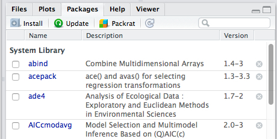

<div class="notes">
Primeiras palavras:

-agradecer o convite!
-apresentação
  graduação e mestrado ecologia ufrj,
  interesse pelo R desde 2011, antes disso era o Caos  
  tutorias disciplina, desenv. pacotes  
  ajudar alunos em análises
</div>


## Objetivos do curso
<div class="notes">
como pensei o curso? 
camilla e a demanda da empresa, problemas com softwares pagos, refazer análises, conhecimento estatística
</div>

- Introduzir o R como linguagem para análises de dados voltados para consultoria ambiental. 
 
- Revisar conceitos de estatística e as análises mais comuns na área ambiental.

- Ao final, cada um deverá ser capaz de criar o próprio código para análises de seus dados. 
    <!-- Código base para as análises mais comuns realizadas pelo participante.-->

- Esse curso **NÃO** pretende:
    + substituir uma disciplina de estatística básica
    + aprofundar-se na programação em R ou outras ferramentas computacionais.


## Programação do curso 


### **Aula 1**  
*	Introdução ao R  
*	Leitura e manipulação de dados  

### **Aula 2**  
*	Análises exploratórias  
    + estatística descritiva
    + gráficos exploratórios
*	Criação e edição de gráfico  
    + parâmetros gráficos
***

### **Aula 3**  
*	Inferência estatística  
*	Modelos lineares  
    + Regressão linear simples e múltipla  
    + Análise de variância e covariância  
* Modelos lineares generalizados


### **Aula 4**  
* Análises de composição e diversidade em comunidades
    + índices de diversidade
    + curva do coletor
    + rarefação
    +estimadores de riqueza
*	Análises multivariadas:  
    +	PCA  
    +	NMDS  
</div>

## Organização do curso

- Apresentações + roteiro de aula

- Roteiros de exercícios "para casa"

- todo material feito no próprio R, disponível em: 

    + http://melinatarituba.github.io/consultR/


<div align="center">
      
</div>

<div class="note">
Tempo, o maior problema!!  

roteiros mais extensos e com conteúdo mais denso, PRECISAM ser feitos!  
não desistir! prestar atenção ao código, deixar ele limpo.  
fazendo as aulas e resolvendo problemas na hora  
</div>


# Aula 1

## Apresentação

“Uma das coisas mais importantes que você pode fazer é dedicar um tempo para aprender uma **linguagem de programação** de verdade.  

Aprender a programar é como aprender outro idioma: exige tempo e treinamento, e não há resultados práticos imediatos...

<div align="center">
<div class="columns-2">
  

</div>
</div>

<div class="note">
quem já conhece/domina alguma linguagem de programação?  
lembrar que vamos errar bastante, e que vamos começar do mais básico  
</div>

## Apresentação 

... mas se você supera essa primeira subida íngreme da curva de aprendizado, os ganhos são enormes.  

<div align="center">
<div class="columns-2">


</div>
</div>
Programar não vai apenas livrar você da camisa de força dos pacotes estatísticos, mas também irá aguçar suas habilidades analíticas e ampliar os horizontes de modelagem ecológica e estatística.”

<div align="center">
Gotelli & Ellison, 2004. Principios de Estatística em Ecologia. Sunderland, Sinauer.
</div>

<div class="note">
falar da minha experiência, dificuldade de aprendizado, e as coisas que faço até hoje, como sempre olhar o help e coódigos dos scripts antigos
</div>

## O que é o R?

- ambiente e linguagem de programação

"A chave para entender o R é que trata-se de uma linguagem. Uma linguagem para manipular objetos." Bill Venables  

"A pergunta certa sobre uma análise em R não é se é possível fazê-la, e sim como fazê-la." Paulo Justiniano Ribeiro

<div class="note">
- linguagem de programação voltada para manipulação, análise e edição gráfica de dados
- também chamado de programa
</div>

## Filosofia do R: O código é tudo!

- Programar com dados, os SEUS dados!  

- Reprodutibilidade 

- _Software_ livre

<div class="note">
há diferentes maneira de fazer a mesma coisa no R
</div>

## Uma questão de costume

<div class="columns-2">


</div>

<div class="note">
assim com é com outros programas, usar o R requer costume
vantagem do R é que você mantém o caminho de tudo que fez - refazer análises!
</div>

## Let´s !
<div align="center">

</div>

<div class="note">
cada vez mais, mais pessoas usam e buscam aprender o R  
comunidade muito ativa, grande documentação online
</div>

## Instalação


https://cran.r-project.org/

<div class="note">
falar que no CRAN tem um monte de manuais e fontes para buscar ajuda -->
</div>

## Estrutura básica da linguagem R
<div align="center">

</div>
## R no Windows

<div class="columns-2">
- Interface gráfica Rgui  
    + editor de texto  
    + console  
    
- Simples, porém pouco prática 


</div>

## Rstudio IDE 
<div align="center">

</div>

<div class="note">
precisa intalar o R e depois usar o Rstudio, clicando no icone
tornar esse programa como padrão para arquivos .R
</div>

## Configurações Rstudio {.bigger}

<div class="note">
abrir o Rstudio e ir mostrando as coisas, as janelas, as facilidades. como criar um novo script
</div>

- Interface mais amigável 

- Visão geral: os 4 painéis

- Global Options: 
    - encoding: UTF-8
    - soft-wrap code

## O R como calculadora {.columns-2}

```{r}
2+5           #Soma
30*7          #Multiplicação
10/2          #Divisão
10^2          #Potência
sqrt(4)       #Raiz quadrada
log(100,10)   #Log na base 10
exp(1)        # n. euler elevado a 1
round(1.987645,2) #arredondamento
abs(-1)       #número absoluto
pi            #3,141618...
```

## Precedência de operações e parênteses {.columns-2}

```{r}
2*4^3-1
2*4^(3-1)
(2*4)^3-1
(2*4)^(3-1)
```
<div class="note">
  lembrar da importância do parênteses!
  sempre haverá uma hora que nos esqueceremos dele!
</div>

## Como criar um objeto {.columns-2}

Objeto <- expressão
```{r}
objeto <- 10+2  # Criando
objeto          # "Chamando"
objeto*10   # x 10
objeto      # ?
objeto2 <- objeto*10   # novo
objeto2   #Agora sim salvou a operação
```

## Fazendo operações com objetos {.columns-2}

```{r}
a <- sqrt(4)
a
b <- 5
a*b
d <- c(2,4,6)
d*b
```
<div class="note">
  explicar o qué é concatenar
</div>

## Funções!

função(argumento1=valor1, argumento2=valor2, ...)

```{r, eval=FALSE}
plot(x=area, y=riqueza, log='xy')

plot(area, riqueza)

log(x=100, base=10)
log(100,10)
```

## Obtendo ajuda!
<div class="columns-2">
```{r, message=FALSE, warning=FALSE, eval=FALSE}
#Abrindo página geral
help.start()

#Busca de termos no help
help.search("linear regression")
??"linear regression"

#Ajuda para funções específicas
help(mean)
?mean

#Argumentos da função
args(mean)

#Exemplo da função
example(mean)
```


</div>

<div class="note">
  mostrar no Rstudio onde fica o help, os locais de busca...      também que quando se dá tab ele tenta completar a funcao e ja mostra o basico do help e argumentos -->
</div>

## Instalando pacotes

<div class="columns-2">
- Diretamente pelo console:
```{r, eval=FALSE}
install.packages("vegan")

```

- Pelo Rstudio ->

- Carregando o pacote instalado*
```{r, eval=FALSE}
library(vegan)
```



</div>

<div class="note">
  uma vez instalado o pacote não precisa mais instalar. mas toda vez que você abrir seu script novamente, terá de fazer o carregamento do pacote. geralmente library() fina no inicio do script, com todos os pacotes usados-->
</div>

## Um erro comum
Funções também são objetos, se você digita uma função sem os parênteses, o R vai exibir o conteúdo da função

```{r}
help
```

## Linguagem orientada a objeto

```{r}
area <- c(100,235,449, 98, 147, 214, 346, 89)
riqueza <- c(56,62,70,33,49,67,71,45)

summary(area)
summary(riqueza)
```

## Como o R funciona?

Os objetos criados são mantidos na memória, até que sejam salvos.

Por default, todos os objetos são salvos em um único arquivo oculto no diretório de trabalho, chamado **.RData**.

Ao sair do programa, o R perguntas se deve salvar as alterações.

## Como trabalhar com o R?

Separe cada projeto em um diretório (pasta)  
- coloque os arquivos de dados  
- inicie o R daquele diretório  

Salve seus comandos em um arquivo  
- salve o código (scritp) das análises no mesmo diretório.  
- o arquivo será um arquivo texto com extensão **.R** ou **.r** 

<div class="note">
  fazer um exemplo de criar uma pasta e um projeto dentro dela
</div>

## Qual o diretório de trabalho atual?

```{r, eval=FALSE}
getwd()
```

Mudando o diretório de trabalho
```{r, eval=FALSE}
setwd( "/Users/melinatarituba/git-meme/consultR_curso")

```

No Rstudio*...

<div class="note">
  ir pro rstudio e mostrar como faz pra mudar o diretorio pelo menu e pela aba de files (more), como faz pra mandar um script pro console, ctrl+r
</div>

## ls e rm: listar e remover objetos

<div class="columns-2">
```{r,eval=FALSE}
ls()
```
[1]  "area" "objeto"  "riqueza"
```{r, eval=FALSE}
rm(objeto)

ls()
```
[1]  "area" "riqueza"

No Rstudio...


</div>

## Classes de objetos

```{r}
class(area)

x <- c("TRUE","FALSE","TRUE","TRUE")
class(x)

x<- as.logical(x)
class(x)
```

## Classe fatores

```{r}
sexo <- rep(c("F","M"),each=9)
sexo
class(sexo)
sexo <- as.factor(sexo) # mudando a classe
sexo
```

## Níveis de um fator

```{r}
levels(sexo)
```
Contagem de observações
```{r}
table(sexo)
```

## Operações com um vetor

Todas as operações aplicadas a um vetor são aplicadas a cada um de seus elementos

```{r}
a <- seq(from=0,to=8,by=2)
a
2*a
sqrt(a)
```


## Operações entre vetores
<div class="columns-2">
Pareando os elementos
```{r,echo=FALSE}
a <- seq(0,8,2)
b <- c(1,15,18,3,6)
```

```{r}
a
b
a+b
a^(1/b)
```
</div>

## Comprimento de vetores

```{r}
length(a)
length(b)

length(a)/length(b)
```

## Funções estatísticas

<div class="columns-2">
```{r}
sum(a)
mean(a)
var(a)
min(a)
max(a)
```
Estas funções operam sobre TODO o vetor, e não elemento a elemento.
</div>

## Funções estatísticas

```{r}
a

summary(a)
```

#Leitura e Manipulação de Dados

## Importando dados

Salvar planilha excel como arquivos **.txt** ou **.csv**
<div align="center">

</div>

<div class="note">
 avisar que existem alguns pacotes que importam xls xlsx
</div>

## Leitura de arquivos texto

```{r}
# arquivo txt com separação tabular
trapa <- read.table(file="../data/trapalhoes.txt", header=T, sep="\n")

#arquivo csv com separação por , ou ;
trapa <- read.table(file="../data/trapalhoes.csv", header=T, sep=";")
trapa

class(trapa); dim(trapa)
```

## Leitura de dados

Cuidado com separador decimal!
```{r, eval=FALSE}
read.table(..., dec = ".") 
read.table(..., dec=",")
```

Tipos de separador de colunas
```{r, eval=FALSE}
read.table(..., sep=";") #csv Brasil
read.table(..., sep="\n") #tabulação
read.table(..., sep=",") #csv internacional
```

<div class="note">
  falar da vantagem em modificar o separador de decimal no computador

 lembrar de sempre usar o HELP da função read.table, há vários argumentos importantes
 </div>

## SEMPRE verifique sua tabela depois de importar

Onde está o erro?
```{r}
trapa2<-  read.table(file="../data/trapalhoes.csv", header=T, sep=",")
trapa2
dim(trapa2)
```

## Vendo a estrutura dos dados importados

<div class="columns-2">
```{r}
dim(trapa)
colnames(trapa)
rownames(trapa)

str(trapa)
```
Colunas com caracteres foram convertidas para **factor**
</div>

## Vendo a estrutura dos dados importados

```{r}
summary(trapa)
```

## Olhando a tabela de dados

```{r}
head(trapa, n=2L)

tail(trapa, n=2L)
```

## Olhando a tabela de dados no Rstudio
<div align="center">

</div>

## Selecionando colunas no data frame $

```{r}
trapa$codinome
trapa$altura
trapa$estado
```

## Criando nova coluna
Uso do $ para criar nova coluna
```{r}
trapa$idade <- 2016 - trapa$nas
trapa
```
Cuidado para não escolher um nome de coluna já existente!

## Criando uma nova coluna a partir de outra

Criando uma coluna do logarítmo de uma variável
```{r}
trapa$log.alt <- log(trapa$alt)
trapa
```

## Substituindo valores nas colunas

```{r}
trapa$vivo
trapa$vivo <- c("TRUE","TRUE", "FALSE", "FALSE")
trapa
```


# Operações com vetores lógicos e indexação

## Operações com vetores lógicos {.flexbox .vcenter}

">" maior que   

"<" menor que  

"==" igual a  

"!=" diferente de  

"&" e  

"|" ou 

## Operações com vetores lógicos

```{r, echo=FALSE}
altura <- c(1.85,1.78,1.92,1.63,1.81,1.55)
sexo <- c(rep("M",3),rep("F",3))
```
```{r}
altura; sexo
altura > 1.80
machos.altos <- altura > 1.80 & sexo =="M"
machos.altos
```

<div class="note">
  lembrar que o == são 2 e não 1
  </div>

## Operações com vetores lógicos

```{r, echo=FALSE}
notas <- c(6,5.1,6.8,2.8,6.1,9.0,4.3,10.4,6.0,7.9,8.9,6.8,9.8,4.6,11.3,8.0,6.7,4.5)
```

```{r}
notas
```
Quantos aprovados?
```{r}
notas >= 5
sum(notas >= 5)
```

## Vetores lógicos em matrizes
```{r,echo=FALSE}
ilhas= matrix(round(sample(c(runif(36,0,6),rep(0,4)))),ncol=8)
colnames(ilhas)<- paste("ilha",1:8)
rownames(ilhas)<- paste("sp",1:5)
```

```{r}
ilhas
ilhas.vf = ilhas > 0  ; ilhas.vf
```

## Extraindo informação da matriz

```{r}
ilhas.vf
```

Quantas espécies por ilha?
```{r}
apply(X=ilhas.vf, MARGIN=2,FUN=sum )
```

## Extraindo informação da matriz

<div class="columns-2">
Quantas ilhas por espécie?
```{r}
apply(X=ilhas.vf, MARGIN=1,FUN=sum )
```


</div>

## Indexação de vetores usando [ ] para isolar elementos

<div class="columns-2">
```{r}
a
a[1]
a[5]
a[1:2]
a[c(1,3,5)]
```
</div>


## Indexação [linha,coluna] em data frames

<div class="columns-2">
```{r,echo=FALSE}
altura <- c(1.85,1.78,1.92,1.63,1.81,1.55)
sexo <- c(rep("M",3),rep("F",3))
peso<- c(80,100,115,70,65,50)
dat<-data.frame(sexo,altura,peso)
```

```{r}
dat

dat[1,]
dat[,2]
dat[1,1]
dat[3,3]
```
</div>

<div align="center">
  A mesma lógica se aplica em matrizes!
</div>

## Indexação operações lógicas em data frames

<div class="columns-2">

```{r}
dat
dat$peso
dat$peso[dat$sexo == "M"]

dat$peso[dat$sexo == "M" & dat$altura > 1.80]
```
</div>

<div class="note">
ficar um tempo nessa, mostrar o script e os resultados de novo no R, ter certeza que aprenderam
</div>


## Exportando dados write.table() {.columns-2}

```{r}
write.table(trapa,"trapa.csv")

write.csv(trapa,"trapa.csv")
```


## Erros mais comuns no R

- Nomes de objetos e funções errados  
```{r, echo=FALSE}
rm(list=ls())
dados <- c(23, 10, 45)
```

```{r, message=TRUE, eval=F}
dadoz
```
      

```{r}
ls()
dados
```

## Fechar parênteses
  + Feche os parênteses ou  
  + Aperte ESC  
```{r, eval=FALSE}
plot(dados$cor,dados$peso
```

## Símbolos inesperados

- Esqueceu a vírgula separando os argumentos?  
-  Colocou espaço entre os nomes de um objeto?  
```{r, echo=F}
aula.pratica<-c(10,8,5,9)
```

```{r, eval=FALSE}
plot(dadoscor dados$peso)

aula pratica
aula.pratica
```


## Como lidar com os erros?

- Leia atentamente as mensagens de erro  

- Acostume-se com as mensagens mais comuns  

- Se não entender, use o google!  

- Perceba a diferença entre mensagem de erro e `warning()`

## Os 10 mandamentos do R {.smaller}
<div class="columns-2">
  
1º Usarás o R em tuas análises e manipulação de teus dados    
2º Nunca digitarás o código no console;  
3º Salvarás seus scripts e não se preocuparás com o .RData;  
4º Sempre concatenarás;  
5º Jamais esquecerás dos parênteses das funções;  
6º Conferirás o diretório de trabalho e os dados antes de enlouqueceres;  
7º Usarás o help antes de perguntares e não culparás o R por teus erros;  
8º Não esmorecerás e jamais amaldiçoarás o R por tuas faltas de vírgulas;  
9º Lembrarás das aspas dos caracteres;  
10º Não cobiçarás e aperfeiçoarás os códigos alheios e nunca ocultarás o código e a autoria original;  

Alexandre Adalardo  
</div>

<div class="note">
  mostrar os livros  
  falar das referências e locais de estudo no tutorial!  
</div>