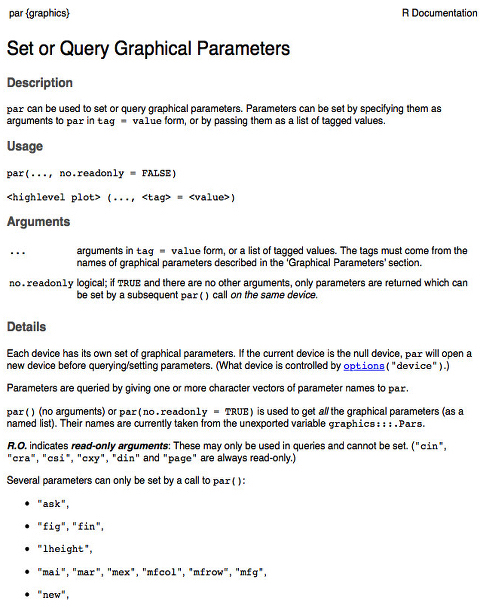

```{r, echo=F}
setwd("/Users/melinatarituba/git-meme/consultR/presentations")
```


# Mais um pouco sobre manipulação e verificação de dados

## Importando dados - matrizes
```{r}
ilhas <- read.csv2("../data/ilhas.csv",header=T,row.names = 1)
ilhas<-as.matrix(ilhas)
ilhas
```

## Totais marginais em matrizes
Abundância por espécie
```{r}
rowSums(ilhas) 
```
Abundância por ilha
```{r}
colSums(ilhas)
```

## Totais marginais: a função apply
Abundância média por espécie
```{r}
apply(X=ilhas, MARGIN=1, FUN=mean)
```
Número de espécies por ilha
```{r}
ilhas.ocor <- ilhas > 0
apply(ilhas.ocor, 2, sum)
```

## Importando data frame
```{r}
sps <- read.csv2("../data/sps.csv",header=T, dec=".")
sps
```

## Estrutura dados
```{r}
str(sps)
```

## Sumário dados
```{r}
summary(sps)
```
<div class="note">
mostrar que o summary é bom para encontrar erros nas tabelas
</div>


## Consertando erros
```{r}
sps[ sps$dieta=="fruto" , ]
sps[9,4] <- "frutos"
sps[9,]
```

## Consertando erros {.columns-2}
Mas a variável continua tendo 4 níveis...
```{r}
sps$dieta
sps$dieta<- as.character(sps$dieta)
sps$dieta<- as.factor(sps$dieta)
sps$dieta

#ou
sps$dieta <- factor(sps$dieta, 
    levels=c("frutos", "insetos", "nectar" ))

```

## Inserindo variáveis
Abundância total das espécies da planilha ilhas:
```{r}
rowSums(ilhas)
sps$abund.tot <- rowSums(ilhas)
head(sps)
```


## Ordenação de data frames  

```{r}
head(sps, n=3L)
```

Ordenando `sps` por peso:
```{r}
sps[ order(sps$peso) , ]
```


## Estatística descritiva {.columns-2}
```{r}
max(sps$compr.asa)
min(sps$compr.corpo)

range(sps$peso)

mean(sps$peso)
sd(sps$peso)
var(sps$peso)

median(sps$peso)
quantile(sps$peso)
```


## Quantis {.columns-2}

```{r}
valores <- c(15,5,3,8,10,2,7,11,12)
```
```{r}
valores.ord<- valores[order(valores)]
valores.ord
```

```{r}
valores.ord[5]

median(valores)

quantile(valores)
```


## Estatística descritiva: contagens {.columns-2}

```{r}
table(sps$cor)

table(sps$dieta)


table(sps$cor, sps$dieta)
```


## Totais marginais: a função `tapply`
Comprimento médio do corpo por dieta
```{r}
tapply(X = sps$compr.corpo, INDEX = sps$dieta, FUN = mean)
```
Peso máximo por cor e dieta
```{r}
tapply(sps$peso, list(sps$cor, sps$dieta), max)
```


## `aggregate` em data frames
abundância média por dieta e cor
```{r}
aggregate(formula = abund.tot ~ cor + dieta, data = sps, FUN = mean)
```

## aggregate em data frames
abundância e peso médio por cor e dieta
```{r}
aggregate(cbind(abund.tot, peso) ~ cor + dieta, sps, mean)
```


#Gráficos no R

## Gráficos no R
- Gráficos exploratórios
    + simples
    + visualisar os dados: relações, padrões, distribuições..
    + encontrar erros e valores atípicos (outliers)

- Gráficos resultado
    + acabamento bem feito
    + mostra informação mais relevante

## O quarteto de Anscombe
```{r, echo=F}
ans<-anscombe
ans[12,] <-apply(ans,2,mean)
ans[13,] <-apply(ans,2,sd)
rownames(ans)[12]<-"media"
rownames(ans)[13]<-"sd"
round(ans,2)
```


## O quarteto de Anscombe
<div align="center">
```{r, echo=F}
lim.x <- c(4,19)
lim.y <- c(3,13)
par(mfrow=c(2,2) ,pch=16, mar=c(3,4,2,2), las=1, mgp=c(1.5,0.5,0))
plot(anscombe$y1~anscombe$x1, col="red", xlab="x1", ylab="y1", xlim=lim.x, ylim=lim.y)
abline(a=3,b=0.5,col="blue")
mtext("média = 7.5, sd = 1.94, correlação=0.81, y = 3 + 0.5x",3,line=.8,cex=1.4, at=15)
plot(anscombe$y2~anscombe$x2,col="red",xlab="x2", ylab="y2", xlim=lim.x, ylim=lim.y)
abline(a=3,b=0.5,col="blue")
plot(anscombe$y3~anscombe$x3,col="red", xlab="x3", ylab="y3", xlim=lim.x, ylim=lim.y)
abline(a=3,b=0.5,col="blue")
plot(anscombe$y4~anscombe$x4, col="red",xlab="x4", ylab="y4", xlim=lim.x, ylim=lim.y)
abline(a=3,b=0.5,col="blue")
```
</div>

<div class="note">
Todos os quatro conjunto de dados são idênticos quando examinado usando estatística básica, mas variam consideravelmente quando graficados
</div>

# Gráficos exploratórios: Uma variável


## Gráficos de barra

Representar as quantitades de alguma variáveis qualitativas (categóricas)
<div align="center"
```{r}
t.dieta <- table(sps$dieta)
barplot(t.dieta, ylab="número de espécies", main="Dieta das espécies")
```
</div>

## Gráficos de barra {.columns-2}

```{r, echo=F}
t.dieta2 <- table(sps$cor, sps$dieta)
cores<-c("yellow3", "darkblue","brown", "darkgreen")
```

```{r, fig.width=5}
barplot(t.dieta2, legend=T, col=cores)

barplot(t.dieta2, beside = T, legend=T, col=cores)
```


## Dados dos pardais

<div class="note">
ver a abrangência dos dados de acordo com a ordem com que foram coletados. 
numero da linha de uma observação é plotado contra o valor da observação.
É útil para encontrar *outliers* em uma variável:
</div>
```{r, echo=F}
pardais <- read.table("../data/Sparrows.txt",header=T)
```

```{r}
head(pardais)
```

## Gráficos de pontos: Pesos de pardais

```{r}
dotchart(pardais$Wt)
```


## Gráficos de pontos condicional

```{r}
dotchart(pardais$Wt, groups =pardais$Sex, gcolor=c("black","red"))
```


### Histogramas: Peso dos animais
<div class="note">
Os histogramas são gráficos que representam a distribuição de frequências dos valores de uma variável quantitativa, servem para vermos a forma da distribuição dos dados.
</div>

```{r}
hist(pardais$Wt)
```

## Histogramas condicionais: lattice

```{r, echo=F}
library(lattice)
```

```{r}
histogram(~Wt|Sex, data= pardais)
```

## Histogramas condicionais: lattice {.columns-2}
```{r, echo=F}
histogram(~Wt|Species, 
          data = pardais,
          layout = c(1,2),
          strip=F,
          strip.left=T)
```


## Boxplots {.columns-2}

<div class="note">
visualiza o centro e o espalhamento dos dados
distribuição
minimo, os quartis 25%, 50% (mediana), 75% e o máximo. _outliers_
</div>
```{r, fig.width=5}
boxplot(pardais$Wingcrd)

boxplot(pardais$Tarsus)
```


## Boxplots condicionais

```{r}
boxplot(Wt~Sex, data=pardais)
```


## Gráficos quantil-quantil

```{r}
qqnorm(pardais$Culmen)
qqline(pardais$Culmen)
```

## Gráficos quantil-quantil

```{r}
#simulando dados normais
normais <- rnorm(n=101,mean = 50, sd = 2)
qqnorm(normais)
qqline(normais)
```


# Gráficos: Duas variáveis


## Gráficos de dispersão
<div class="note">
observar a relação entre duas variáveis contínuas. Ou seja serve para inspecionar visualmente se duas variáveis são associadas.
</div>
```{r}
plot(pardais$Tarsus, pardais$Wingcrd)
```

## Scatterplot condicional
```{r}
xyplot(Wt~Head|as.factor(Observer), data=pardais)
```

## Scatterplot condicional

Cores diferentes para cada sexo
```{r, echo=F}
#criando vetor com cores
cores <- ifelse(pardais$Sex=="Male", "red", "black") 

```

```{r}
plot(Wt~Head, data=pardais, col=cores, pch=16)
```


## Pairs - correlações

```{r, echo=F}
## colocar histogramas de frequência na diagonal do plot
panel.hist <- function(x, ...)
{
    usr <- par("usr"); on.exit(par(usr))
    par(usr = c(usr[1:2], 0, 1.5) )
    h <- hist(x, plot = FALSE)
    breaks <- h$breaks; nB <- length(breaks)
    y <- h$counts; y <- y/max(y)
    rect(breaks[-nB], 0, breaks[-1], y, col = "cyan", ...)
}
## colocar os valores das correlações com tamanho proporcional à correlação
panel.cor <- function(x, y, digits = 2, prefix = "", cex.cor, ...)
{
    usr <- par("usr"); on.exit(par(usr))
    par(usr = c(0, 1, 0, 1))
    r <- abs(cor(x, y))
    txt <- format(c(r, 0.123456789), digits = digits)[1]
    txt <- paste0(prefix, txt)
    if(missing(cex.cor)) cex.cor <- 0.8/strwidth(txt)
    text(0.5, 0.5, txt, cex = cex.cor * r)
}
```


```{r}
pairs(pardais[ ,3:5], upper.panel = panel.cor, diag.panel = panel.hist)
```

# Edição de gráficos

## Parâmetros gráficos {.columns-2}

- Argumentos de funções gráficas que os modificam
    + na própria função
    + na função `par( )`

 

## Plot base
```{r, echo = F}
riqueza <- c(15,18,22,24,25,30,31,34,37,39,41,45)
area <- c(2,4.5,6,10,30,34,50,56,60,77.5,80,85)
local <- rep(c("lago1", "lago2"), each=6)
```

<div align="center">
```{r}
plot(riqueza~area)
```
</div>

## Aumentando os tamanhos de eixos e pontos {.columns-2}
Argumento de `par`
```{r, fig.width=5}
par(cex=1.5)
plot(riqueza~area)
par(cex=1) # para voltar ao tamanho padrão
```

Argumento de `plot`
```{r, fig.width=5}
plot(riqueza~area, cex=1.5)
```

Para "limpar" os parâmetros de `par`, ou volta com o valor inicial de par ou fecha o dispositivo gráfico (`dev,off`)

## Mudando a cor e o formato dos pontos do gráfico 
<div align="center">
```{r, echo=F}
par(cex=1.5)
```

```{r}
plot(riqueza~area, pch=4, col="orangered2")
```
</div>

## Mudando a cor e o formato dos pontos do gráfico 
<div align="center">
```{r}
par(cex=1.5)
plot(riqueza~area, pch=16, col="deeppink")
```
</div>

## Mudando nome de eixos e títulos dos gráficos
<div align="center">
```{r}
plot(riqueza~area, xlab = "Área", ylab="Número de Espécies", 
     main= "relação espécies-área")
```
</div>

## Mudando nome de eixos e títulos dos gráficos
<div align="center">
```{r}
# área em metros quadrados
plot(riqueza~area, xlab = expression("Área (m"^2*")"), 
     ylab="Número de Espécies", main= "Borboletas do Parque")
```
</div>

## Dois gráficos num mesmo plot
<div align="center">
```{r}
par(mfrow=c(1,2))
plot(riqueza~area, col=cores, pch=16)
boxplot(riqueza~local)
```
</div>

## Inserindo mais informações em gráficos

Funções de nivel inferior (**low-level plotting commands**)

- `lines`  

- `axis`  

- `points`  

- `segments`  

- `text`  

- `legend`  

- `rect`  


## `lines()`
<div align="center">
```{r, fig.width=5}
plot(riqueza~area)
lines(area, riqueza)
lines(lowess(area,riqueza), col="red")
```
</div>

## `abline()`
 <div align="center">
```{r}
model <-lm(riqueza~area)
plot(riqueza~area)
abline(model) # reta da regressão
```
</div>

## `abline()`
<div align="center">
```{r}
plot(riqueza~area)
abline(v=mean(area), lty=2, col="darkgreen") # linha vertical
abline(h=mean(riqueza), lty=4, col="purple") # linha
```
</div>

## `text()` e `mtext()`  {.columns-2}
<div align="center">
```{r}
plot(riqueza~area)
text(x=10,y=43, "texto aqui")
```
</div>

## trocando a legenda do texto
<div align="center">
```{r}
plot(riqueza~area, xlab="")
mtext(side=1, "área do lago", line=3, cex=2)
```
</div>

## `axis()`

Inserindo novo eixo no gráfico
<div align="center">
```{r}
plot(riqueza~area, xaxt="n")
axis(1, at=seq(0,80,20), labels=c("zero", "vinte", "quarenta", "sessenta", "oitenta"))
```
</div>

## sobrepondo outro gráfico

Incluir os dados de umidade dos locais no eixo Y2.
<div align="center">
```{r, echo=F}
umidade <- c(82,91,78,57,48,45,35,38,21,15,24,33)

#dando mais espaço para a margem direita
par(mar=c(5,4,4,4))

plot(riqueza~area)

par(new=T) # para permitir sobrescrever o gráfico

#plotando a nova variável Y2, mas sem desenhar o eixo
plot(umidade~area, yaxt="n", ylab="",type="l") 

# desenhando o eixo de Y2
axis(4)
mtext("Umidade (%)",4, line = 2)
```
</div>

## sobrepondo outros gráficos

```{r, eval=F}
plot(riqueza~area)

par(new=T) # para permitir sobrescrever o gráfico

#plotando a nova variável Y2, mas sem desenhar o eixo
plot(umidade~area, yaxt="n", ylab="",type="l") 

# desenhando o eixo de Y2
axis(4)
mtext("Umidade (%)",4, line = 2)
```


## `points`
<div align="center">
```{r, echo=F}
riq.lago2 <- riqueza[local=="lago2"]
area.lago2 <- area[local=="lago2"]
```

```{r}
plot(riqueza~area, pch=16, cex=2, col="orange")
points(riq.lago2~area.lago2, pch=16, col="purple", cex=2)
```
</div>

## Incluindo legendas

```{r, eval=F}
legend("topleft", legend= c("lago 1", "lago 2"), pch=16, col=c("orange", "purple"), bty="n")
```
<div align="center">
```{r, echo=F}
plot(riqueza~area, pch=16, cex=2, col="orange")
points(riq.lago2~area.lago2, pch=16, col="purple", cex=2)
legend("topleft", legend= c("lago 1", "lago 2"), pch=16, col=c("orange", "purple"), bty="n")
```
</div>

## Salvando gráficos em arquivos de imagem

Extensões mais comuns:  

- jpeg
- pdf
- bmp
- png

Help em `grDevice`


## Exemplo

```{r, eval=F}
jpeg(filename = "figurinha.jpg", width = 480, height = 480)
plot(riqueza~area)
dev.off()
```

## Salvando no Rstudio

...

## Abrir janela de dispositivo no Rstudio

Geralmente usado em gráficos muito grandes

```{r,eval=F}
# abrindo uma janela para fazer o gráfico, à parte do Rstudio
x11()
# fazendo o plot
plot(riqueza~area)

# o plot será enviado diretamente para a janela aberta.
```


