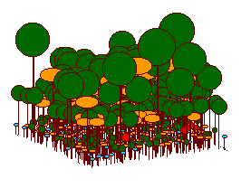
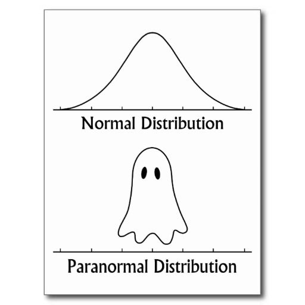
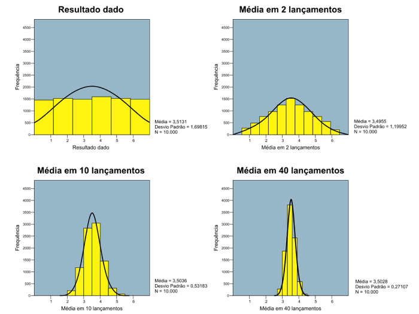
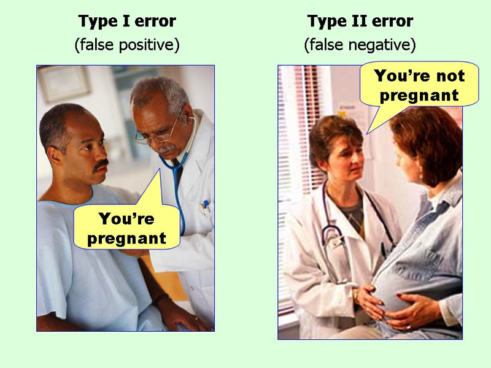

```{r, echo=F}
setwd("~/git-meme/consultR/presentations")
```

## Um problema

<div align="center">
Qual é a alturas média das árvores em uma floresta?



</div>

## Inferência estatística

 - Fazer afirmações sobre as características de uma **população**, com base em informações dadas por **amostras**.

- **População** é qualquer conjunto de elementos que você está observando

- **Amostra** é qualquer subconjunto desta população.

### Ajustando um modelo

- **Estimar** parâmetros da população baseados na amostra, **modelo teórico de distribuição de probabilidades**

## Modelo de distribuição para altura das árvores

- **Variável Aleatória** de **distribuição de probabilidades Normal** com média (μ) e desvio padrão (σ).

<div align="center">
```{r dados importados, echo=F}
arv <-read.table("../data/arvores.csv", sep=";", header=T)
hist(arv$alt, main="Altura das árvores, média = 22,7; sd = 5,6")
mean(arv$alt); var(arv$alt); sd(arv$alt)
```
</div>

## Definindo variáveis aleatórias

A variável aleatória X é uma variável que tem um valor único (determinado aleatoriamente) para cada resultado de um experimento (lembre-se esse termo veio da teoria de probabilidade). 

Exemplos:

a. Altura das árvores de uma floresta (!!)

b. Número de presas capturadas por um predador em um determinado dia;

c. Comprimento de um peixe adulto selecionado aleatoriamente.

As variáveis aleatórias podem ser **discretas** ou **contínuas**.


## Função de probabilidade 

Função que define as probabilidades P(X) para cada valor possível da variável X.

**Distribuição de Probabilidades**.

<div align="center">
```{r normal, echo=F}
mean=22.7; sd=5.6
lb=10; 
ub=40

x <- seq(-4,4,length=100)*sd + mean
hx <- dnorm(x,mean,sd)

plot(x, hx, type="n", xlab="X", ylab="Densidade",
  main="Distribuição Normal, Média = 25, sd= 4", axes=FALSE)
axis(1)
axis(2)
i <- x >= lb & x <= ub
lines(x, hx)
abline(v=22.7, lty=2)
```
</div>


# Algumas Distribuições de Probabilidade

## Bernouli: X ~ Bernouli(p)

- Discreta, valores possíveis 0 e 1. _p_ - probabilidade de sucesso  
- Jogar moedas: cara - 0, coroa - 1.  
- Presença/ausência de uma espécie em locais amostrados

<div align="center">
```{r bernoulli, echo=F}
plot(dbinom(0:1, size=1, prob=0.3), 
    xlim=c(0,3), ylim=c(0,1), 
    xlab="resultados previstos",
    ylab="Probabilidade", 
    main="Distribuição Bernoulli p=0.3",
    type="h", xaxt="n")
axis(1, at=c(1,2), labels = c(0,1))
```
</div>

## Binomial: X ~ Bin(n, p)

- Discreta: **número de sucessos** em **n** tentativas . _p_ - prob sucesso.

- Número sementes predadas em cada experimento contendo 20 semente.

- Número de animais infectados em relação ao número de capturados em cada local


## Exemplo Binomial

- Predação de girinos por odonatas, p = 0.30.   
Total girinos: 6 num lago. 
- Qual probabilidades de que 0, 1, 2, 3, 5 ou todos sejam predados?

<div align="center">
```{r binomial, echo=F}
plot(y=dbinom(0:6, size=6, prob=0.3), 
    x=c(0:6),
    xlab="Número de girinos predados",
    ylab="Probabilidade", 
    main="Distribuição binomial:  n=6, p=0.3",
    type="h")
```
</div>

## Poisson:  X ~ Pois(λ)

- Discreta: Probabilidade de uma série de eventos ocorrem em um período fixo de tempo, área, volume, quadrante, etc. 

- Dados de contagem

- Abundância de espécies em um local

- Número de indivíduos capturados por tempo

## Exemplo Poisson

- Número de visitas de borboletas em uma planta em 15 min: 10
- Probabilidade de 5 visitas `dpois(5,10)`

<div align="center">
```{r poisson, echo=F}
# histograma da distribuição
plot(dpois(seq(1,20, by =1), lambda = 10), type ="h",
     xlab = "Número de visitas", 
     ylab = "Probabilidade", 
     main = "Função massa de probabilidade")
```
</div>

## Normal: X ~ N(μ, σ) {.columns-2}

- Simétrica, contínua

- Metade (50%) dos dados está acima (e abaixo) da média 

- 68% dados está dentro de 1 desvio padrão da média  

- 95% está dentro de 2 desvios padrões da média  

- Virtualmente todos os valores estão dentro de 3 desvios padrões da média  




## Exemplo Normal

- Qual é a probabilidade de que um peixe capturado aleatoriamente tenha 20,15 cm ou mais? Média da população é 17,1 cm, desvio padrão 1,21 cm? 

```{r normal2, echo=F}
prob <- pnorm(q = 20.15, mean = 17.1, sd = 1.21, lower.tail = F)
prob
```

<div align="center">
```{r, echo=F}
x<-seq(13, 22, 0.1)
y=dnorm(x, mean = 17.1, sd=1.21)
plot(x, y, type="l", lwd=2, col="red", 
     ylab = "Probabilidade",
     xlab= "Comprimento dos peixes",
     main ="Função densidade de probabilidade")
abline(v = 17.1, lty=2)
abline(v = 20.15, lty=3)
text(x=21,y=0.3, labels="P = 0.006")
```
</div>

## Teorema do Limite Central

"Toda soma de variáveis aleatórias independentes de média finita e variância limitada é aproximadamente Normal, desde que o número de termos da soma seja suficientemente grande."

Independentemente do tipo de distribuição da população, na medida em que o **tamanho da amostra** aumenta, a distribuição das médias amostrais tende a uma **distribuição Normal**.

## Exemplo TLC
<div align="center">

</div>

## Voltando ao nosso problema

- Dados de duas espécies
```{r}
levels(arv$sp)
```

 Será que a altura média de uma espécie nessa floresta é diferente da altura média da outra espécie? 
 
Ou seja, será que as espécies possuem uma **mesma distribuição de probabilidades** e as diferenças encontradas são devido ao **acaso** ou será que cada espécie é uma variável aleatória com médias diferentes?

## Distribuições de frequências das alturas para cada espécie
<div align="center">
```{r histograma, echo=F}
library(lattice)
histogram(~alt|sp, 
          data = arv,
          layout = c(1,2),
          strip=F,
          strip.left=T)
```
</div>

## Diferença entre as médias das alturas

```{r dif medias}
mean(arv$alt[arv$sp=="sp2"]) - mean(arv$alt[arv$sp=="sp1"])
```

Posso afirmar que as médias são diferentes?

**H0** - não há diferença entre as alturas das duas espécies. A média da altura da espécie 1 é igual à média da altura da espécie 2 e a diferença observada se deve ao acaso.  

**H1** - há diferença entre as alturas das duas espécies. A média da altura da espécie 1 é diferente da média da altura da espécie 2.

## Erros associados a escolher cada hipótese como verdadeira

AFIRMAÇÃO: não há diferença entre as alturas das espécies,  
VERDADE: há diferenças.   


AFIRMAÇÃO: há diferença entre as alturas das espécies,  
VERDADE: não há diferenças.  

### Definição formal dos erros:


**ERRO DO TIPO I (α)**: rejeitar a hipótese nula dada que ela é verdadeira.

**ERRO DO TIPO II (B)**: aceitar a hipótese nula dado que ela é falsa.


***



##  Testando as hipóteses

Contrastar a probabilidade de que a diferença que você encontrou nas médias das alturas das duas espécies pode se considerada devido ao acaso ou não. 

Qual é a probabilidade de que as duas amostras pertencem à mesma população de medidas? 

Podemos ou não rejeitar a hipótese nula (de que a diferença é ao acaso), baseado em alguma probabilidade de estarmos cometendo algum erro (α).

## Graus de liberdade

"O número de observações independentes menos o número de parâmetros estimados."

Quantas observações independentes foram usadas para calcular a média e a variância dos dados sob a hipótese nula?

Nosso exemplo:
100 árvores  - 2 parâmetros  = 98 graus de liberdade  

## Estatística t


Não entraremos em detalhes de como se calcula a estatística t e como é a sua distribuição de probabilidades (recomendo ver na [wikipedia](https://pt.wikipedia.org/wiki/Distribui%C3%A7%C3%A3o_t_de_Student)). O importante a saber aqui é que tendo as duas amostras modeladas como uma distribuição normal, calculamos a estatística t e com um certo valor de graus de liberdade, nós podemos recorrer às tabelas da distribuição t para ver qual a probabilidade de se obter aquele valor que obtivemos dada que a hipótese nula é verdadeira. Se esta probabilidade for muito pequena, a chance de estarmos caindo no erro do tipo 1 é pequena.

```{r teste t}
t.test(arv$alt~arv$sp, var.equal=T)
#o argumento var.equa=T diz que as variâncias das duas espécies são as mesmas
# podemos fazer o teste com a premissa de que as variâncias não sejam iguais,
# usando var.equal=F, isso vai "consumir" graus de liberdade.
```


 

# Modelos lineares

E se tivéssemos na verdade 3 espécies de árvores para compararmos as alturas? Acabamos de ver que o teste t serve apenas para comparar duas amostras. O que chamamos de modelos lineares é uma grande família de modelos estatísticos que modelam uma relação linear entre a variável dependente (Y) e a(s) variável(is) independente(s). Nesta família encontra-se o teste t que acabamos de ver, a Análise de Variânci (ANOVA), a regressão, etc.

Chamamos de **Modelos Lineare Gerais** (LMs), aqueles que possuem como premissa a variável dependente Y como de distribuição Normal, e de **Modelos Lineares Genearlizados** (GLMs) os que assumem outros tipos de distribuição para a variável dependente (como a Binomial e Poisson). No R, a função que usamos para estes modelos são `lm` e `glm` (há alguns mais específicos como o prórpio `t.test` e o `aov` para ANOVA). O R lida com todos os modelos lineares de maneira similar, e um detalhe importante é que todas as análises desta família devem ser salvas em um objeto, para seu resultado ser apresentado após o comando `summary`.

É importante lembrar que neste roteiro estamos lidando com modelos paramétricos, ou seja, que **modela a variável de interesse como uma variável aleatória pertencente a uma certa distribuição de probabilidades**. Existem outras abordagens estatísticas não-paramétricas que fazem testes que não tem como premissa a distribuição de probabilidades. Veja um exemplo de **teste t não paramétrico** neste [roteiro](http://ecologia.ib.usp.br/bie5782/doku.php?id=bie5782:02_tutoriais:tutorial6:start). 

Mesmo fazendo parte de uma mesma família de modelos, nas sessões seguintes vamos separar os modelos lineares pelos nomes tradicionais das análises: análise de variância, regressão linear simples e análise de covariância. Depois, veremos alguns exemplos de GLMs aplicáveis a dados ecológicos.


## ANOVA

Vamos então incluir no nosso exemplo inicial uma terceira espécie amostrada (e vamos diminuir o número de amostras por espécie para ficar mais fácil de fazer os cálculos passo a passo):
```{r dados3}
alt.sp3 <- c(36.90076761,33.23131727,32.82767311,24.93410577,31.87626329,
         28.76824248,26.6436144,31.41238398,27.65383929,31.70425719,
         33.60752445,28.30263354,29.32210674,23.4790054,22.20793046,
         18.28797293,23.39044736,28.75820917,29.94344703,34.47430235,
         32.09820862,26.99845592,27.64858951,31.90557306,33.63236368,
         25.35966179,35.00885172,32.89125598,18.98802229,30.8516906,
         22.04191398,35.37232889,35.67150408,34.30257037,24.43038475,
         20.6274663,31.15717916,23.27023231,36.20568545,34.33068448,
         28.40769054,31.00578874,29.50989158,31.69915991,37.25975797,
         30.1279997,38.623371,35.36472829,29.88304259,31.00145491)

sp3 <- data.frame(alt=alt.sp3, sp=rep("sp3",50))
arv2 <- rbind(arv,sp3)

amostras <- seq(1,150,by=5)

arv3 <- arv2[ amostras, ]
```

Neste exemplo lidaremos com um modelo simples de anova chamado **_one way_ ANOVA**, porque lida apenas com uma variável independente categórica (fator). 

A ANOVA testará a hipótese nula de que as médias das alturas das 3 espécies não diferem. 

Faremos agora a ANOVA "na unha", para entendermos melhor cada passo da análise e a interpretação de seus resultados para depois usarmos a função do R que faz esta análise diretamente.

### ANOVA na unha

Vamos calcular os valores da tabela de ANOVA. Começando com os desvios quadráticos, ou seja, quanto os dados desviam da média (idéia parecida com a variância). O ponto importante é que essa variação é aditiva e portanto, pode se decomposta. A variação total é decomposta em variação relacionada ao tratamento (_entre grupos_), no nosso caso às espécies, e uma variação interna dos grupos (chamada de erro). A estatística F é a razão entre essas variaões após dividir cada uma delas pelos seus respectivos graus de liberdade. Complicou? Vamos fazer os cálculos e ver os gráficos para ver se entendemos melhor:

A tabela de ANOVA que vamos construir é essa:


Primeiro vamos mudar a forma do nosso data frame para facilitar os comandos
```{r}
arv4 <- data.frame(sp1=arv3$alt[arv3$sp=="sp1"],
                   sp2=arv3$alt[arv3$sp=="sp2"],
                   sp3=arv3$alt[arv3$sp=="sp3"])
arv4

boxplot(arv4)
```
Vamos calcular a média geral, as médias para cada espécie, e as diferenças entre a média geral e a média para cada espécie, para chegar ao valor da soma dos quadrados total:
```{r}
media.geral <- mean(arv3$alt)
media.geral

medias.sps <- apply(arv4, 2, mean)
medias.sps

dif.geral <- arv4 - media.geral
ss.especies <- dif.geral^2
ss.especies

ss.total <- sum(ss.especies)
ss.total
```

Para calcular os desvios quadráticos totais, nós subtraímos cada altura das árvores pela média geral e elevamos ao quadrado. Veja o gráfico:
```{r}
vetor.cor <- rep(1:3, each=10) #vetor de cores

plot(x = c(1:30), y = arv3$alt, ylim=c(10,40),
     pch=(rep(c(15,16,17), each=10)),
     col=vetor.cor,
     ylab="Variável Resposta", xlab="Observações",
     main="Variação total")
	for(i in 1:30)
	{
	lines(c(i,i),c(arv3$alt[i],mean(arv3$alt)),col=vetor.cor[i])
	}
	abline(h=media.geral)
```


Agora vamos fazer a somatória dos desvios quadráticos dentro de cada grupo (ss.intra).

O gráfico para entender esse cálculo:
```{r}
vetor.medias<-rep(medias.sps, each=10)

plot(c(1:30), arv3$alt, ylim=c(10,40),
     pch=(rep(c(15,16,17),each=10)),
     col=vetor.cor,
     main="Variação Intra Grupos",
     ylab="Variável Resposta", xlab="Observações")
	for(i in 1:30)
	{
	lines(c(i,i),c(vetor.medias[i],arv3$alt[i]),col=vetor.cor[i])
	}
	lines(c(1,10),c(medias.sps[1],medias.sps[1]),col=1)
	lines(c(11,20),c(medias.sps[2],medias.sps[2]),col=2)
	lines(c(21,30),c(medias.sps[3],medias.sps[3]),col=3)
```

Cálculo dos valores:
```{r}
medias.sps
ss.sp1=sum((arv4$sp1-medias.sps["sp1"])^2)
ss.sp1
ss.sp2=sum((arv4$sp2-medias.sps["sp2"])^2)
ss.sp2
ss.sp3=sum((arv4$sp3-medias.sps["sp3"])^2)
ss.sp3
ss.intra=ss.sp1+ss.sp2+ss.sp3
ss.intra
```

A soma dos quadrados entre grupos:
```{r}
plot(c(1:30), vetor.medias, ylim=c(10,40), 
  pch=(rep(c(15,16,17),each=10)),
  col=vetor.cor, 
  main="Variação Entre Grupos", 
  ylab="Variável Resposta", xlab="Observações")
 for(i in 1:30)
	{
	lines(c(i,i),c(vetor.medias[i],mean(vetor.medias)),col=vetor.cor[i])
	}
	abline(h=media.geral)
	points(c(1:30),arv3$alt, ylim=c(10,50), 
	       pch=(rep(c(0,1,2),each=10)), col=vetor.cor, cex=0.5)
```

```{r}
medias.sps
media.geral
ss.entre=10*sum((medias.sps-media.geral)^2)
ss.entre

#conferindo os cálculos
ss.intra+ss.entre
ss.total
```

Cálculo do F
```{r}
# Desvios médios
ms.entre=ss.entre/2
ms.intra=ss.intra/27
ms.entre
ms.intra

#F - razão das variâncias
F.sps=ms.entre/ms.intra
F.sps
```

#### Distribuição F

Vamos ver na distribuição F qual a probabilidade de termos econtrado o valor `F.sps` ao acaso:
```{r}
curve(expr=df(x, 2,27),
      main="Distribuição F de Fisher (df=2,27)", 
      xlab="Valor F",
      ylab="Densidade Probabilística (df)",
      xlim=c(2,12))
abline(v=F.sps, col="red")
abline(h=0, lty=2)

xf=seq(F.sps, 12, 0.01)
ydf=df(xf, 2, 27)
polygon(c(F.sps,xf),c(0,ydf),col="red")

text(x= 7,y=0.08,paste("pf(x) =",
     round(pf(F.sps,2,27,lower.tail=F),4)), 
     cex=0.8, col="red")
```

Cálculo do P
```{r}
p.sps=pf(F.sps, 2, 27, lower.tail=FALSE)
p.sps
```

Para mais informações sobre o F e as comparações com o teste t, veja esse [roteiro](http://daniellakens.blogspot.com.br/2016/04/one-sided-f-tests-and-halving-p-values.html).

### A tabela final

Colocando os dados calculados em nossa tabela de anova


### ANOVA no R

A função que constrói esta tabela de ANOVA e faz o teste estatístico é a `aov`. Vamos comparar:

```{r aov}
anova.sps <- aov(alt~sp, data=arv3)
summary(anova.sps)
```

Agora nós sabemos de ondem vem os números nesta tabela e como foi calculado o P, certo?

## Testes à posteriori

Onde estão as diferenças?

- veja os gráficos

- faça teste à posteriori - Tukey HDS


```{r tukey}
TukeyHSD(anova.sps)

#revendo gráfico dos dados
stripchart( arv3$alt~arv3$sp,
           vertical = TRUE, pch = 16, 
           col = c("black", "red", "green"))

#boxplot
boxplot(arv4)
```


## Outra maneira de fazer a ANOVA no R:


```{r anova lm}
lm.anova.sp <- lm(alt~sp, data=arv3)
summary.aov(lm.anova.sp) #mesmo que o summary do aov

# mostra o resultado de forma um pouco diferente, consegue entender?
summary(lm.anova.sp) 
```


## Regressão linear simples

- Y contínuo - X continuo


```{r dados regr, echo=F}
# criando a variável nutrientes
nutri <- c(1.09, 1.73, 1.49, 2.84, 3.08, 8.24, 8.67, 6.10, 8.37, 8.03,
           10.62, 14.26, 13.77, 14.81, 14.40, 17.27, 15.46, 18.66, 16.03,
           17.37, 26.80, 27.1, 29.09, 20.46, 24.51, 28.56, 24.87, 27.44,
           26.02, 22.94)

# ordenando arv3 por altura (para criar uma relação com nutrientes)
arv3 <-arv3[order(arv3$alt), ]

#colocando no data.frame de dados
arv3$nutri <- nutri

plot(arv3$alt ~ nutri)
```

## Modelo da Regressão

```{r mod regr}
alt.nutr <- lm(alt ~ nutri, data = arv3)
summary(alt.nutr)
```

## Plot da Regressão

```{r plot regr2, echo=F}
plot(arv3$alt ~ nutri)
abline(alt.nutr, col = "red") # reta da regressão

#reta da hipótese nula de ausência de efeito dos nutrientes
abline(h = mean(arv3$alt), col = "blue", lty = 2)  
```

## Análise de Covariância

- Y continuo

- X1 contínuo - X2 categórico

```{r, echo=F}
plot(alt~nutri, data=arv3, col=arv3$sp)
```

## Modelo da ANCOVA: aditivo

```{r ancova aditivo}
alt.sp.nutr <- lm(alt ~ nutri + sp, data = arv3)
summary(alt.sp.nutr)
```

## Gráfico ANCOVA aditivo
<div align="center">
```{r ancova plot, echo=F}
# tirando os valores de intercepto do modelo para cada especie
#coef(alt.sp.nutr)
int.sp1 <- coef(alt.sp.nutr)[1]
int.sp2 <- coef(alt.sp.nutr)[1]+coef(alt.sp.nutr)[3]
int.sp3 <- coef(alt.sp.nutr)[1]+coef(alt.sp.nutr)[4]

plot(alt~nutri, data=arv3, col=arv3$sp)

# reta de regressão para espécie 1
abline(a=int.sp1, b=coef(alt.sp.nutr)[2], col="black")
# reta de regressão para sp 2
abline(a=int.sp2, b=coef(alt.sp.nutr)[2], col="red")
# reta de regressão para ps 3
abline(a=int.sp3, b=coef(alt.sp.nutr)[2], col="green")
```
</div>

## Modelo ANCOVA com interação

```{r, echo=F}
alt.sp.nutr2 <- lm(alt ~ nutri + sp + nutri:sp, data=arv3)
```

```{r ancova interativo}
alt.sp.nutr3 <- lm(alt ~ nutri*sp, data=arv3)
summary(alt.sp.nutr3)
```

## Gráfico ANCOVA com interação
<div align="center"
```{r ancova graf, echo=F}
# interceptos
int.sp1 <- coef(alt.sp.nutr2)[1]
int.sp2 <- coef(alt.sp.nutr2)[1] + coef(alt.sp.nutr2)[3]
int.sp3 <- coef(alt.sp.nutr2)[1] + coef(alt.sp.nutr2)[4]

#coeficientes
coef.sp1 <- coef(alt.sp.nutr2)[2]
coef.sp2 <- coef(alt.sp.nutr2)[2] + coef(alt.sp.nutr2)[5]
coef.sp3 <- coef(alt.sp.nutr2)[2] + coef(alt.sp.nutr2)[6]

plot(alt~nutri, data=arv3, col=arv3$sp)

abline(a=int.sp1, b=coef.sp1, col="black", xlim=c(0.5))
abline(a=int.sp2, b=coef.sp2, col="red")
abline(a=int.sp3, b=coef.sp3, col="green")
```
</div>

## Tabela de ANOVA do modelo
```{r ancova test}
summary.aov(alt.sp.nutr3)
```

## Modelos lineares generalizados

- Outras distribuições de probabilidades além da Normal

- Variâncias não homogêneas

Mais comuns:

- Poisson – úteis para dados de contagem

- Binomial – úteis para dados com proporções, ou presença/ausência
 

## Etapas do GLM

1. Uma hipótese sobre a distribuição da variável resposta Yi.

2. Especificação do modelo (variáveis X).

3.Função de ligação entre a média Yi e as variáveis X. Função que lineariza a regressão 

## Funções de ligação

<div align="center">
Distribuição | link function
-------------|-------------------
normal | identity
poisson | log
binomial | logit
Gamma | reciprocal
</div>


## GLM Poisson 

- Y - Número de atropelamentos de anuros em uma estrada

- X - distância a um Parque Nacional. 

```{r, echo=F}
atrop <- read.table("../data/atropela.csv", header = T, sep = ";")
```

```{r pois plot, echo=F}
plot( atrop$TOT.N ~ atrop$D.PARK,
      xlab = " Distância ao parque",
      ylab = "Número de atropelamentos")
```

## Modelo GLM Poisson

```{r pois mod}
mod <- glm(TOT.N ~ D.PARK, data = atrop, family = poisson)
summary(mod)
```

## Testando contra hipótese nula
```{r pois test}
anova(mod, test = "Chisq")
```

## Gráfico Modelo GLM Poisson
```{r, echo=F}
coefi <- coef(mod)
coefi
```
<div align="center">
```{r pois plot2, echo=F}
plot(atrop$TOT.N~atrop$D.PARK,
     xlim = c(0,25000), ylim = c(0, 110),
     xlab = "Distância ao parque", ylab = "Número de atropelamentos")

#essa função plota a curva do modelo, colocamos exp para voltar à escala original dos dados
curve(exp(coefi[1] + coefi[2]*x), 
      xlim = c(0,25000), ylim = c(0, 110),
      xlab = "", ylab = "", 
      add=T, #adicionando a curva no plot já desenhado
      col="red")
```
</div>


## GLM Binomial

 - Y - Quantidade de veados infectados dentre os capturados
 
 - X - quantidade de vegetação aberta 

```{r echo=F, results='hide'}
veados <- read.table("../data/veados_parasitas.csv", header=T, sep=";")

str(veados)
summary(veados)

prop.veados <- veados$infectado/veados$amostrado
prop.veados
```

```{r binom plot, echo=F}
plot(prop.veados ~ veados$openland,
     ylim=c(0,1),
     xlab = "Porcentagem de vegetação aberta",
     ylab="Proporção de veados infectados")
```

## Modelo GLM binomial
```{r binom cbind}
nao.infectado <- veados$amostrado- veados$infectado
y <- cbind(veados$infectado, nao.infectado)
mod.veado <- glm(y ~  openland, data=veados, family="binomial")
summary(mod.veado)
```

## Teste GLM binomial
```{r binom test}
anova(mod.veado, test = "Chisq")
```

## Gráfico GLM binomial
```{r}
# salvando os coeficientes
coefs <- coef(mod.veado)
coefs
#lembre que estes coefs foram linearizados com a função de ligação
# para a binomial a link function é a logit
# então temos que transformar os y no inverso do logit, a função é essa:
invlogit = function(x) return(exp(x)/(1+exp(x)))
```

<div aling="center">
```{r binom plot2, echo=F}
plot(prop.veados ~ veados$openland,
     ylim=c(0,1))
#usando o invlogit para desenhar a curva:
curve(invlogit(coefs[1] + coefs[2]*x), add=T, col="red")
```
</div>


# Checando as premissas dos modelos

## Teste de normalidade {.columns-2}

Teste de Shapiro-Wilks

- H0: dados são normais

```{r shapiro}
shapiro.test(arv3$alt)

shapiro.test(arv$alt[arv$sp == "sp1"])
shapiro.test(arv$alt[arv$sp == "sp2"])
```

## Teste de homogeneidade de variâncias

Teste de Bartlett:
```{r bartlett}
bartlett.test(arv3$alt~arv3$sp)
```

## Teste homogeneidade de variâncias
Teste de Levene:
```{r, echo=F}
# carregando o pacote car que tem a função do teste
library(car)
```

```{r levene}
leveneTest(arv3$alt~arv3$sp)
```


## Checagem do ajuste do modelo - Resíduos

<div align="center">
RESÍDUO = Y(observado) - Y(dados ajustados)
</div>

A premissa de normalidade na verdade recai sobre os resíduos do modelo. 

```{r resid}
resid(anova.sps)
#residuals(anova.sps) # o mesmo que a função de cima
```

## `plot` do modelo 
<div align="center">
```{r res anova, echo=F}
# separando a área gráfica em 4 espaço para os 4 gráficos
par(mfrow=c(2,2))
plot(anova.sps)
```
</div>

## Resíduos regressão
<div align="center">
```{r res lms}
par(mfrow=c(2,2))
# regressão: alt ~ nutri
plot(alt.nutr)
```
</div>

## Resíduos ANCOVA aditivo
<div align="center">
```{r}
par(mfrow=c(2,2))
# ANCOVA modelo aditivo: alt ~ nutri + sps
plot(alt.sp.nutr)
```

## Resíduos ANCOVA interativo
<div align="center">
```{r}
par(mfrow=c(2,2))
# ANCOVA modelo interativo: alt ~ nutri * sps
plot(alt.sp.nutr2)
```
</div>

## Resíduos GLM poisson
<div align="center">
```{r}
par(mfrow=c(2,2))
# GLM poisson: atrop ~ dist.park
plot(mod)
```
</div>

## Resíduos LM com a poisson
<div align="center">
```{r}
par(mfrow=c(2,2))
plot(lm(TOT.N ~ D.PARK, data = atrop))
```
</div>


## Resíduos GLM binomial
<div align="center">
```{r}
par(mfrow=c(2,2))
# GLM binoimial: prop.infectado ~ openland
plot( mod.veado)
```
</div>

## Resíduos LM com a binomial
<div align="center">
```{r}
par(mfrow=c(2,2))
plot( lm(prop.veados ~ veados$openland))
```
</div>

```{r, echo=F}
# para "desligar" o par inicial
par(mfrow=c(1,1))
```
