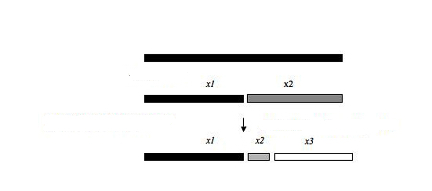

```{r, echo=F, warning=FALSE, message=F}
#setwd("./presentations")

library(vegan)
library(BiodiversityR)
library(plot3D)
```


# Análises da riqueza de espécies

## Pacotes e formatos de dados

- `vegan`

- `BiodiversityR`

- matriz de espécies
    + locais nas linhas
    + espécies nas colunas
    
- matriz de variáveis ambientais
    + locais nas linhas
    + variáveis nas colunas
    
    
## Vegetação em dunas - espécies

```{r, echo=F}
data("dune")
```

```{r}
dim(dune)
```

```{r, echo=F}

dune[1:10,1:8]
```

## Vegetação em dunas - ambiente 

```{r, echo=F}
data("dune.env")
head(dune.env, 10L)
```

```{r, echo=F, results='hide'}
str(dune.env)
```

## Curva de acumulação de espécies

- Número acumulado de espécies registradas (S) em função do esforço amostral (n)

- Unidade amostral:

    - curva **baseada em indivíduo**

    - curva **baseada em amostra**

## Curva baseada em amostra
```{r}
(Accum <- accumresult(dune, method = 'collector'))
```

## Curva baseada em amostra
<div align="center">
```{r, echo=F}
accumplot(Accum)
```
</div>

## Curva do coletor x curva de rarefação

- Coletor: plotando acumulação de acordo com a ordem de amostragem

- Rarefação: 

    + riqueza média por amostra (`method = exact`) 
    
    + riqueza média por aleatorização (`method = rarefaction` or `method = random`)

## Curva de rarefação - exact method {.smaller}

```{r}
(Accum.1 <- accumresult(dune, method='exact'))
```


## Curva de rarefação - exact method 

<div align="center">
```{r, echo=F}
accumplot(Accum.1)
```
</div>

## Curva de rarefação - random method {.smaller}

```{r}
(Accum.2 <- accumresult(dune, method='random', permutations=1000))
```

## Curva de rarefação - random method

<div align="center">
```{r, echo=F}
accumplot(Accum.2)
```
</div>

```{r, echo=F, results='hide'}
Accum.21 <- accumresult(dune, method='rarefaction')
Accum.21
accumplot(Accum.21)
```

## Curva baseada em indivíduo

- usando método baseado em amostra:

  - re-escalonar o eixo x para número de indivíduos baseado no tamanho médio de indivíduos por amostra
  
- útil para comparar locais com número de indivíduos diferente por amostra.

## Curva baseada em indivíduo  {.smaller}

```{r}
# sabendo o total de indvíduos por local
dune.env$site.totals <- apply(dune,1,sum)

(Accum.5 <- accumresult(dune, y=dune.env, scale='site.totals', method='rarefaction'))
```

## Curva baseada em indivíduo
<div align="center">
```{r, echo=F}
accumplot(Accum.5, xlab='pooled individuals')
```
</div>

## Método de rarefação

- Comparar riqueza entre comunidades quando o tamanho amostral ou abundâncias diferem. 
    + comparações baseadas na comunidade com menos amostras ou indivíduos 
    + consistência taxonomica
    + mesmas técnicas de coleta; 
    + os tipos de hábitat semelhantes

- é um método para estimar a riqueza de espécies em uma amostra menor 

<div align="center">
**Não pode ser usado para extrapolar e estimar riqueza!!**
</div>

## Curva de acumulação para comparar riquezas 

<div align="center">
```{r}
Accum.6 <- accumcomp(dune, y = dune.env, factor = 'Management', method = 'exact', legend = F)
```
</div>


## Estimando o número total de espécies

- métodos de extrapolação 

- métodos baseados em diferentes premissas de como as espécies se acumulam além da área amostrada

- pesos maiores ou menores à espécies raras.

## Jackniffe 1 e 2

- Somando a riqueza obsevada a um parâmetro calculado a partir do número de **espécies raras** e do **número de amostras**. As duas equações diferem basicamente em relação ao critério pelo qual se consideram uma espécie como rara. 

$$  S_{jack1} = S_{obs} + Q_1\frac{m-1}{m} $$

$$ S_{jack2} = S_{obs} + Q_1\frac{2m-3} {m} - Q_2\frac{(m-2)^2} {m(m-1)} $$

- $Q_j$: número de espécies que ocorrem em j amostras;

- $m$: número de amostras;


## Jackniffe 1 e 2

```{r}
(Diversity.5 <- diversityresult(dune, index='jack1'))

(Diversity.6 <- diversityresult(dune, index='jack2'))
```

## Chao

- Baseados no número de espécies raras dentro de uma amostra.

    + Número espécies representadas por apenas um indivíduo (**_singletons_**)  ou que ocorre em apenas uma amostra (**_uniques_**)
    
    + Número de espécies com apenas dois indivíduos (**_doubletons_**) ou que ocorrem respectivamente em uma ou em duas unidades amostrais (**_duplicates_**).


$$ S_{chao} = S_{obs} + \frac{F_1^2} {2F_2^2} $$

- $F_j$: número de espécies que tem exatamente j indivíduos em todas amostras juntas ou que ocorrem em exatamente j amostras


## Chao 1 e 2

- Chao 1: abundância das espécies

- Chao 2:  presença/ausência 

```{r}
Diversity.7 <- diversityresult(dune, index='chao')
Diversity.7
```

## Bootstrap

- Utilizar dados de **todas as espécies coletadas** para estimar a riqueza total, não se restringindo às espécies raras. 

- Soma a riqueza observada à soma do inverso da proporção de amostras em que ocorre cada espécies. 

$$ S_{boot} = S_{obs} + \sum_{k=1}^{S_{obs}}(1-p_k)^m $$

- $p_k$: proporção de amostras que contém a espécie k;

- $m$: número de amostras;

## Bootstrap
```{r}
Diversity.8 <- diversityresult(dune, index='boot')
Diversity.8
```

## Estimando o número total de espécies

- Reportar a variação nos valores obtidos com os diferentes métodos e esperar que o valor total correto esteja dentro desse intervalo. 

<div align="center">
```{r, echo=F}
accumplot(Accum.5, xlab='pooled individuals', ylim=c(0,35))
points(x=685, y=Diversity.5, col='red')
points(x=685, y=Diversity.6, col='blue')
points(x=685, y=Diversity.7, col='green')
points(x=685, y=Diversity.8, col='black')
```
</div>


# Análises de diversidade em comunidades

## Diversidade de espécies

- Leva em consideraçaõ **Riqueza**, **Dominância** e **Raridade**

Índices de diversidade:

- Diversidade

- Equabilidade

## Diversidade

<div align="center">
Local | sp1 | sp2 | sp3 | sp4 | sp5
------|-----|-----|-----|-----|-----
A     | 1   | 1   | 1   | 0   | 0
B     | 1   | 1   | 1   | 1   | 1
C     | 4   | 2   | 1   | 0   | 0
D     | 2   | 2   | 2   | 0   | 0
</div>

- Local B tem mais riqueza que local A - mesma equabilidade

- Local C e D tem mesma riqueza - local D tem mais equabilidade.

## Índice de Simpson

- Mais simples, robusto

- $D$ Probabilidade de 2 indivíduos sorteados de uma comunidade pertencerem à mesma espécie

<div align="center">
$$ D_1 = 1 - \sum_{i=1}^S P_i^2 $$

$$ D_2 = \frac{1}{\sum_{i=1}^S P_i^2} $$

</div>

- Para uma dada riqueza $S$, $D$ aumenta com a equabilidade, e para uma dada equabilidade, $D$ aumenta com a riqueza. 

##  Índice de Simpson {.columns-2}

- N = 100; S = 10

```{r, echo=F}
ni=c(91,1,1,1,1,1,1,1,1,1)
sim <- data.frame(ni=ni,pi=ni/100, pi2 = (ni/100)^2)
sim 
```
```{r}
(D = sum(sim$pi2))
(D1 = 1-D)
(D2 = 1/D)
```


## Equabilidade de Simpson

$D2_{max} = S$ valor máximo do índice se todas as sps tivessem mesmo N indivíduos.

$$ E = \frac{D2} {D2_{max}} = \frac{1}{\sum_{i=1}^S P_i^2} x \frac{1}{S}$$

- Desvantagem: não dá muito peso à espécies raras

```{r}
(D2max = 10)

(E = D2/D2max)
```


## Índice de Simpson

```{r}
# Simpson 1-D
(diversity.simp <- diversity(dune, index='simpson'))

# todos locais agrupados
(divers.all <- diversityresult(dune, index = "Simpson", method='all'))
```

## Índice de Simpson

```{r}
# inverso de simpson:
(diversity.invsimp <- diversity(dune, index='invsimpson'))
```


## Índice de Shannon

- Índice mais utilizado na literatura

- Geralmente valores entre 1.5 e 3.5 (raramente acima de 5)

- É sensível à espécies raras 

- É sensível a variações nas abundâncias


$$ H = -\sum_{i=1}^S P_i lnP_i $$
</div>

Equabilidade:

<div align="center">
$$J = \frac{H} {H_{max}} = \frac{-\sum_{i=1}^S P_i lnP_i} {lnS} $$
</div>

## Índice de Shannon

```{r}
sim

(shan <- -(sum(sim$pi*log(sim$pi))))

(Hmax = log(10))
(Hshan <- shan/Hmax)
```


## Índice de Shannon

```{r}
diversity.sha2 <- diversityresult(dune, index='Shannon', method='s')
diversity.sha2


# Equabilidade de Shannon:
diversity.shaE <- diversityresult(dune, index='Jevenness', method='s')
diversity.shaE
```


## Índice de Dominância de Berger-Parker 

Este índice é geralmente recomendado por ser intuitivamente simples e fácil de calcular e por significado biológico:

<div align="center">
$$ d = \frac{N_{max}}{N} $$
</div>

- $N_{max}$ número de indivíduos da espécie mais abundante

- $N$ número total de indivíduos da comunidade.

Porém é um índice problemático apra comunidades com poucas espécies (S<15 espécies). 

## Berger-Parker

```{r}
sim
(berger <- 91/100)
```


```{r}
(diversity.ber <- diversityresult(dune, index='Berger', method='s'))
```


## Perfil de diversidade de Rényi

- Curvas que provém informação sobre a riqueza e equabilidade das espécies. 

- Técnica de ordenação da diversidade. 

- Quanto menos horizontal um perfil é, menos equitativa é a distribuição das espécies. 

- Perfis que iniciam em um alto nível tem maior riqueza.  

- Vantagem: locais podem ser facilmente ordenados da maior para a menor diversidade.

- Se o perfil de um local está sempre acima de outro, então este é mais diverso que o segundo. Mas se os perfis se cruzam, é provável que um local tenha mais riqueza, enquanto outro mais equabilidade. 

## Perfil de Rényi - diversidade

```{r, echo=F}
abcd <- matrix(c(1,1,4,2,1,1,2,2,1,1,1,2,0,1,0,0,0,1,0,0), nrow=4, 
               dimnames=list(c("A", "B","C","D"), c("sp1","sp2","sp3","sp4","sp5")))
abcd
reu <- renyiresult(abcd, method='s')
```
<div align="center">
```{r, echo=F}
renyiplot(reu, legend=F)
```
</div>

## Pefil de Rényi - equabilidade
<div align="center">
```{r, echo=F}
renyiplot(reu, legend=F, evenness = T)
```
</div>

## Perfil de Rényi - alfa

- **alfa = 0** log da riqueza de espécies

- **alfa = infinito** 1/log(proporção da espécie mais abundante)

- **alfa = 1** é o Índice de **diversidade de Shannon**

- **alpha = 2** é o logarítmo do Índice de **diversidade de Simpson** (1/D).


## Perfil de Rényi - Diversidade
<div align="center">
```{r, echo=F}
Renyi.1 <- renyiresult(dune)

renyiplot(Renyi.1,legend=F)
```
</div>

## Perfi de Rényi - equabilidade
<div align="center">
```{r, echo=F}
renyiplot(Renyi.1, evenness=TRUE, legend=F)
```
</div>

## Perfil de Rényi por local
```{r,echo=F}
Renyi.2 <- renyiresult(dune, method='s')
```

<div align="center">
```{r, echo=F}
renyiplot(Renyi.2, legend=F)
#renyiplot(Renyi.2, evenness=TRUE, legend=F)
```
</div>


## Perfil de Rényi X índices de diversidade

- índices de diversidade são mais compactos 

- Porém, não provém informação suficiente para ordenar locais da maior para menor diversidade. 

- Perfil de Rényi permite concluir se um local é mais diverso que o outro. 

## Comparando diversidade entre locais

- Para comparar diversidade em locais com tamanhos amostrais diferentes, é preciso re-amostrar locais com menor número de amostras obtidas em um local.

- Criar perfis com reamostragens aleatórias 

```{r, results='hide', eval=F}
Renyi.3 <- renyicomp(dune, y = dune.env, factor = 'Management',
                     permutations = 100, legend = F)
```

## Rényi: comparando diversidade entre locais
<div align="center">
```{r, echo=F}
Renyi.3 <- renyicomp(dune, y = dune.env, factor = 'Management',
                     permutations = 100, legend = F)
```
</div>

# Análises das diferenças na composição de espécies


## Análises das diferenças na composição de espécies


- **Agrupamento**: agrupar objetos (locais) em grupos de maneira que objetos do mesmo grupo sejam mais semelhantes entre si do que objetos de outros grupos. 

- **Ordenação**: os objetos são posicionados num espaço que contém menos dimensões que o conjunto de dados original;


## Distância Ecológica

- Descreve a diferença na composição de espécies de forma que locais que compartilhem muitas espécies devem ter distância ecológica pequena.

- Calculada a partir da matriz de espécies

- Gera uma nova matriz - de distâncias!


## Distância Euclidiana

```{r, echo=F}
mat <- matrix(c(1,5,0,1,5,0,0,0,1), nrow=3,
              dimnames = list(c("A","B","C"), c("sp1","sp2","sp3")))
```
```{r, echo=F}
mat
```

```{r, echo=F}
scatter3D(x = mat[,1], y = mat[,2], z = mat[,3], 
          xlim = c(0, 6), ylim = c(0, 6), zlim = c(0, 4),
          xlab = "sp1", ylab = "sp2", zlab = "sp3", 
          colkey = F, ticktype = "detailed", phi = 10, 
          pch = 16, cex=2)

text3D(x = mat[ , 1] + 0.2, y = mat[ , 2] + 0.2, 
       z = mat[ , 3] + 0.3, labels = c("A", "B", "C"), add = T)

lines3D(mat [ , 1], mat[ , 2], mat[ , 3], add = T, colkey = F)
lines3D(mat[-2,1], mat[-2, 2], mat[-2, 3], add = T, colkey = F)
```

## Distância Euclidiana {.columns-2}

```{r}
mat
vegdist(mat, method="euclidean")
```

- Não é uma boa distância ecológica para dados brutos da matriz de espécie, depende muito das abundâncias 

- A e B estão distantes mas compartilham mesmas espécies

## Distância Euclidiana dados transformados

- Dividindo as abundâncias das espécies pela abundância total do local

```{r}
#abundância total por local
abund.t <- apply(mat, 1, sum)

#matriz transformada para abundancias relativas
mat2 <- mat /abund.t
mat2

```

## Distância Euclidiana dados transformados 

```{r, echo=F}

#distância euclidiana
dist(mat2)

scatter3D(x = mat2[,1], y = mat2[,2], z = mat2[,3], 
          xlim = c(0, 1), ylim = c(0, 1), zlim = c(0, 1),
          xlab = "sp1", ylab = "sp2", zlab = "sp3", 
          colkey = F, ticktype = "detailed", phi = 10, 
          pch = 16, cex=2)
text3D(x = mat2[1, 1] + 0.1, y = mat2[1, 2] + 0.1, 
       z = mat2[1, 3] + 0.1, labels = c("A"), add=T)
text3D(x = mat2[2, 1] + 0.1, y = mat2[2, 2] - 0.1, 
       z = mat2[2, 3] + 0.2, labels = c("B"), add=T)
text3D(x = mat2[3, 1] + 0.1, y = mat2[3, 2] + 0.1, 
       z = mat2[3, 3] + 0.1, labels = c("C"), add=T)

lines3D(mat2[ , 1], mat2[ , 2], mat2[ , 3], add = T, colkey = F)
```

## Distância de Bray-Curtis

- Valores de distância restritos entre 0 e 1
    + 0: s dois locais são completamente similar (mesmas espécies)
    + 1: totalmente dissimilares (sem espécie em comum)

```{r}
vegdist(mat, method = 'bray')
```


## Análise da distância ecológica por Ordenação

- Ordenação arranjam as comunidades (locais) de forma que as distâncias entre elas no gráfico representem suas distâncias ecológicas.

- Locais próximos no gráfico tem composição de espécies similar, locais afastados contém composição de espécies diferente. 
- Muito útil para analisar dados de comunidades ecológicas, que estão geralmente estruturadas em gradientes.

## Passos da ordenação

1. Os dados podem ser transformados e o tipo de transformação depende da questão formulada e análise a ser realizada.

2. É construída uma matriz de distâncias entre os objetos (locais).

3. O "programa" então arranja os objetos ao longo de um ou mais eixos que melhor refletem os padrões encontrados nos dados. Estes eixos refletirão as variáveis ecológicas (ou gradientes) que causaram os padrões nos dados. 


## Escalonamento multidimensional não paramétrico (NMDS)

- pode ser considerado uma análise indireta de gradiente, útil para ver se há padrões nos dados

- pode produzir a ordenação de objetos de qualquer matriz de distâncias


## Dados de espécies em um gradiente de precipitação

<div align="center">
```{r, echo=F}
# dados fictícios
tab <- matrix(c(9,0,0,0,4,0,8,6,2,0,0,10,
              1,1,0,2,0,1,0,0,0,2,0,0,
              0,0,0,1,0,0,0,0,2,1,4,0,
              0,0,0,1,0,0,0,0,2,1,4,0,
              0,0,4,0,6,0,7,3,3,0,1,1,
              0,1,0,2,0,0,0,0,1,1,0,0),
              nrow=12)
colnames(tab) <- c("spA", "spB", "spC", "spD", "spE","spF")
tab

# dados de precipitação
(prec <- c(270, 315, 200, 255, 190, 290, 150, 125, 230, 290, 240, 100))
```
</div>


## NMDS

- Objetivo: descrever o padrão apresentado pelas seis espécies em menos dimensões

- Cada espécie representa uma dimensão

- Ordenação dos objetos (locais), em relação aos atributos (espécies)


## NMDS matriz de distância {.smaller}

```{r}
(distmatrix <- vegdist(tab, method = 'bray'))
```


## NMDS passos

1. Escolha das dimensões (eixos) para descrever os dados: 2

2. Ordenar os locais nos eixos

3. Verificar o quanto as distâncias entre eles ficaram proporcionais às da matriz de distâncias original

4. Re-arranjar os locais e verificar se o resutado melhorou... até achar melhor resultado (menor STRESS)

## NMDS 

```{r}
initNMS <- NMSrandom(distmatrix, perm=100, k=2)
model1 <- postMDS(initNMS, distmatrix)

# adicionando os escores das espécies no modelo 
model1 <- add.spec.scores(model1, tab, method='wa.scores')
# permite colocar a ordenação das espécies no mesmo gráfico

model1$stress
#esses valor de stress está em % porcentagem
```

## NMDS

<div align="center">
```{r, echo=F}
#plotando o NMDS
plot5 <- ordiplot(model1, type='text', cex=1.5)
```
</div>

## Comparando resultado do NMDS com gradiente de precipitação

-  Ver se o eixo MDS1 foi capaz de capturar o padrão existente nos dados:

<div align="center">
```{r, echo=F}
# categorizando os dados de precipitação 
prec.cat <- c("A","A","B","A","B","A",
              "B","B","B","A","A","B")

plot6 <- ordiplot(model1, type='none')
text(x=model1$points[,1], y=model1$points[,2],
     labels=prec.cat)
text(x=model1$cproj[,1], y=model1$cproj[,2],
     labels=colnames(tab), col='red' )
```
</div>


## Comparando resultado do NMDS com gradiente de precipitação

<div align="center">
```{r, echo=F}
m<-lm(prec~model1$points[,1])
#summary(m)

plot(x=model1$points[,1], y=prec, main=paste("R²=",round(RsquareAdj(m)[[1]],2)))
abline(m, col='red')
```
</div>

## STRESS (Standard Residuals Sum of Squares)

- medida do quanto as posições de objetos e uma configuração tridimensional desviam-se das distâncias originais 

- stress < 0.05 representação excelente;

- stress <0.01 boa ordenação

- stress < 0.2 ordenação razoável

- stress > 0.2 ordenação inviável (interpretação pode ficar comprometida)


## Shepard Diagram

- Para acessar a adequação da análise: comparar as distâncias entre objetos na ordenação com as distâncias originais

```{r, echo=F, results='hide'}
# NMDS usando as funções do pacote vegan
spec <- metaMDS(tab, distance = 'bray',k=2)
spec

spec$stress
# esse valor de stress está entre 0 e 1

#plot6 <- ordiplot(spec, type='text')
```

<div align="center">
```{r, echo=F}
# Shepard diagram
stressplot(spec)
```
</div>

## Análise de componentes principais (PCA)

- Usada para: 
    + reduzir a dimensionalidade dos dados
    + verificar como as amostras se relacionam
    
- Só é possível usar a distância euclidiana

- Principal aplicação em ecologia é a ordenação dos locais com base nas variáveis ambientais quantitativas

- mais recentemente usada para análise de dados da comunidade (após transformação).

## PCA

- Vantagem:  
    + retirar a multicolinearidade das variáveis
    + permite transformar um conjunto de variáveis originais intercorrelacionadas em um novo conjunto de variáveis não correlacionadas (os componentes principais). 

- Desvantagem:
    + somente distância euclidiana
    + somente dados quantitativos
    + premissa de normalidade multidimensional
    

## PCA passos

- padronização dos dados - adimensinonalidade

- Extrair matriz de distância euclidiana

- Rodar a PCA

- Escolher o número de eixos significativos

- Interpretar os resultados

## Dados abundância de peixes em rios

```{r, echo=F}
spe <- read.csv("../data/DoubsSpe.csv", row.names=1)
spe[1:6,1:18]
env <- read.csv("../data/DoubsEnv.csv", row.names=1)
env[1:6,]
```

## PCA variáveis ambientais (padronizadas) {.smaller}

```{r, echo=F}
pca1 <- rda(env, scale=TRUE)

summary(pca1)
```


## PCA resultados 

- **Componentes principais**: são as combinações lineares das variáveis, eixos ortogonais (independentes) que resumem (explicam) a variação dos objetos

- **Autovalores (eigenvalues)**: medida de importância (variância) dos componentes principais (eixos) e traz a porcentagem de explicação de cada eixo.

- **Autovetores (eigenvectors)**: coeficientes de combinação linear, medem a importância de uma variável em cada eixo.

- **Escores (Z1, Z2, Zn)**: posição das unidades amostrais ao longo de um eixo de ordenação, pode se referir tanto à unidades amostrais quanto à variáveis. Escores são fornecidos pela substituição dos valores assumidos pelas variáveis originais nas combinações lineares. São utilizados para ordenar as unidades amostrais em um diagrama uni, bi ou tridimensional.


## Summary PCA

- **Species scores**: coordenadas das pontas das setas das variáveis. Por razões históricas, as variáveis resposta são sempre chamadas de 'species' no `vegan` , não importando o que representam (nesse caso as variáveis ambientais).

- **Site scores**: coordenadas dos locais no diagrama de ordenação. Os objetos são sempre chamados de 'sites' no `vegan`, e nesse caso são os locais mesmo (mas poderiam ser outras coisas).

## Autovalores PCA

- selecionando os eixos mais importantes

- método **Broken Stick**:
    + quebrar um bastão de comprimento X em N pedaços aleatóriamente
    + X -   inertia total
    + N - número de eixos do PCA

<div align="center">
 
</div>

## Autovalores PCA

<div align="center">
```{r}
screeplot(pca1)
points(bstick(pca1), col="red", type='o')
```
<div>


## Plotando os resultados da PCA

- escala 1 (_scaling 1_): ótima para observar as relações entre os **objetos (locais)**. As distâncias entre os objetos no biplot são aproximações das distâncias euclidianas no espaço multidimensional.

- escala 2 (_scaling 2_) ótima para observar as relações entre as **variáveis**. Os ângulos entre as variáveis no biplot reflete suas correlações. 


## Plotando os resultados da PCA 
```{r, echo=F, fig.show='hide', results='hide'}
pcplot1 <- biplot(pca1, scaling=1, type="text")
pcplot2 <- biplot(pca1, scaling=2, type="text")

pcplot1 <- ordiplot(pca1, scaling=1, type="text")
ordiequilibriumcircle(pca1, pcplot1 , col='red')
```

```{r, echo=F}
source("../data/cleanplot.pca.r")
```
<div align="center">
```{r, echo=F}
cleanplot.pca(pca1)
```
</div>

## PCA em matriz de espécies

- transformação de _Hellinger_:

    + dividir as abundâncias de cada espécie em um local pela abundância total do local (linhas) e a raiz quadrada 
    
    + reduz o a importância de grandes abundâncias na distância euclidiana.

- Pode ser usada também para dados binários presença/ausência

## PCA em matriz de espécies
```{r}
# Transformando os dados
spe.h <- decostand(spe, "hellinger")
spe.h.pca <- rda(spe.h)
summary(spe.h.pca)
```

##  PCA em matriz de espécies
```{r, echo=F}
screeplot(spe.h.pca)
points(bstick(spe.h.pca), col="red", type='o')
```


## PCA em matriz de espécies

<div align="center">
```{r, echo=F}
cleanplot.pca(spe.h.pca)
```
</div>
