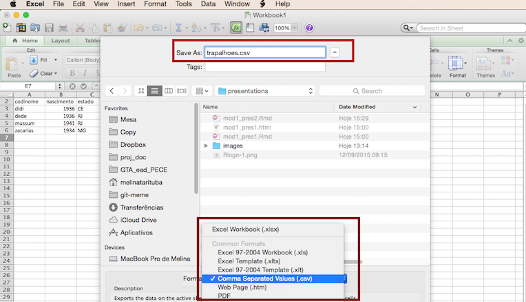

## Importando dados

Salvar planilha excel como arquivos **.txt** ou **.csv**
<div align="center">

</div>

## Leitura de arquivos texto

```{r}
trapa <- read.table(file="trapalhoes.txt", header=T, sep="\n")
trapa <- read.table(file="trapalhoes.csv", header=T, sep=";")
trapa
class(trapa); dim(trapa)
```

## Leitura de dados

Cuidado com separador decimal! 
    - default no R é ponto, em computadores em português é vírgula*
```{r, eval=FALSE}
read.table(..., dec = ".") 
read.table(..., dec=",")
```
- tipo de separador de colunas:
```{r, eval=FALSE}
read.table(..., sep=";")
read.table(..., sep="\n") #tabulação
read.table(..., sep=",")
```

<!-- falar da vantagem em modificar o separador de decimal no computador, fazer agora? --> 

## Leitura de dados arquivo .csv

- default para `read.csv`
```{r, eval=F}
read.csv(..., sep=",", dec=".")

# Para computadores em português

read.csv2(..., sep=";", dec=",")
```


## Verifique sempre sua tabela depois de importar

```{r}
trapa2<-  read.table(file="trapalhoes.csv", header=T, sep=",")
trapa2
dim(trapa2)
```


## Vendo a estrutura dos dados importados

<div class="columns-2">
```{r}
dim(trapa)
colnames(trapa)
rownames(trapa)

str(trapa)
```
Colunas com caracteres foram convertidas para **factor**
</div>

## Vendo a estrutura dos dados importados

```{r}
summary(trapa)
```


## Outros argumentos da função read.table

Colunas com caracteres convertidos em classe **character** ('as.is=T')
```{r}
trapa3 <- read.table(file="trapalhoes.csv", header=T, sep=";", as.is=TRUE)
str(trapa3)
```

## Outros argumentos da função read.table

Colocando nome nas linhas ('row.names=')
```{r}
trapa4 <- read.table(file="trapalhoes.csv", header=T, sep=";", row.names=1)
trapa4
rownames(trapa4)
```


## Olhando a tabela de dados

```{r}
head(trapa, n=2L)

tail(trapa, n=2L)

```

## Olhando a tabela de dados no Rstudio
<div align="center">

</div>

## Mudando nomes de colunas

```{r}
colnames(trapa)
colnames(trapa) <- c("cod", "nas", "est", "viv", "alt")
trapa
```
```{r, echo=FALSE}
colnames(trapa) <-colnames(trapa3)
```


## Mudando nomes de linhas

```{r}
rownames(trapa)
rownames(trapa) <- c("trap1","trap2","trap3", "trap4")
trapa
```

## Mudando nomes das linhas

<div class="columns-2">
```{r}
rownames(trapa) <- paste("trapa",1:4,sep='')
trapa
```


<!-- explicar funçao paste com o help mostrando os ... -->

</div>

## Vendo cada coluna do data frame $

Uso do $ para selecionar colunas no data frame
```{r}
trapa$codinome
trapa$altura
trapa$estado
```

## Criando nova coluna
Uso do $ para criar nova coluna
```{r}
trapa$idade <- 2015 - trapa$nas
trapa
```
Cuidado para não escolher um nome de coluna já existente!

## Criando uma nova coluna a partir de outra
Criando uma coluna do log de uma variável
```{r}
trapa$log.alt <- log(trapa$alt)
trapa
```


## Substituindo valores nas colunas

```{r}
trapa$vivo
trapa$vivo <- c("TRUE","TRUE", "FALSE", "FALSE")
trapa
```

## Criando matrizes

<div class="columns-2">
```{r}
matrix(1:12, nrow=4, ncol=3)
matrix(1:12, nrow=4, ncol=3, byrow=T)
```


</div>

## Convetendo data frame para matriz

<div class="columns-2">
```{r}
a<- data.frame(1:4,2:5,3:6)
class(a)
a<-as.matrix(a)
class(a)
a
```
</div>

## Matrizes

```{r}
ilhas <- matrix(seq(from=1,to=80,by=2),ncol=8)
ilhas
```

## Mudando nomes de colunas e linhas de matrizes

```{r}
colnames(ilhas)<- paste("ilha",1:8)
rownames(ilhas)<- paste("sp",1:5)
ilhas
```

## Listas - contém objetos de qualquer classe
```{r,echo=FALSE}
a<-c(3,2,4,5,2,2)
area = c(100,235,449, 98, 147, 214, 346, 89)
riqueza <- c(56,62,70,33,49,67,71,45)
modelo1 <- lm(area~riqueza)

```

<div class="columns-2">

```{r}
a
trapa

modelo1

```
</div>

## Minha lista

```{r}
minha.lista <- list(um.vetor=a,
                    um.data.frame=trapa,
                    um.modelo=modelo1)

minha.lista
```

## Selecionando um elemento da lista

```{r}
minha.lista$um.vetor
minha.lista$um.modelo
```


## Operações com vetores lógicos

```{r, echo=FALSE}
altura <- c(1.85,1.78,1.92,1.63,1.81,1.55)
sexo <- c(rep("M",3),rep("F",3))
```
```{r}
altura; sexo
altura >1.80
machos.altos = altura>1.80 & sexo=="M"
machos.altos
```


## Operações com vetores lógicos

">" maior que   

"<" menor que  

"==" igual a  

"!=" diferente de  

"&" e  

"|" ou 

## Operações com vetores lógicos

```{r, echo=FALSE}
notas <- c(6,5.1,6.8,2.8,6.1,9.0,4.3,10.4,6.0,7.9,8.9,6.8,9.8,4.6,11.3,8.0,6.7,4.5)
```

```{r}
notas
```
Quantos aprovados?
```{r}
notas>=5
sum(notas>=5)
```

## Vetores lógicos em matrizes
```{r,echo=FALSE}
ilhas= matrix(round(sample(c(runif(36,0,6),rep(0,4)))),ncol=8)
colnames(ilhas)<- paste("ilha",1:8)
rownames(ilhas)<- paste("sp",1:5)
```

```{r}
ilhas
ilhas.vf = ilhas>0 
ilhas.vf
```

## Extraindo informação da matriz

```{r}
ilhas.vf
```

Quantas espécies por ilha?
```{r}
apply(X=ilhas.vf, MARGIN=2,FUN=sum )
```

## Extraindo informação da matriz

<div class="columns-2">
Quantas ilhas por espécie?
```{r}
apply(X=ilhas.vf, MARGIN=1,FUN=sum )
```


</div>

## Indexação de vetores usando [ ] para isolar elementos

<div class="columns-2">
```{r}
a
a[1]
a[5]
a[1:2]
a[c(1,3,5)]
```
</div>


## Indexação operações lógicas em vetores

```{r, echo=FALSE}
peso<- c(80,100,115,70,65,50)
```


<div class="columns-2">
```{r}
altura
peso
sexo

machos.altos = altura>1.80 & sexo=="M"
peso[machos.altos]
```
</div>

## Indexação [linha,coluna] em data frames

<div class="columns-2">
```{r,echo=FALSE}
dat<-data.frame(sexo,altura,peso)
```

```{r}
dat

dat[1,]
dat[,2]
dat[1,1]
dat[3,3]
```
</div>

## Indexação operações lógicas em data frames

<div class="columns-2">

```{r}
dat
dat$peso
dat$peso[dat$sexo=="M"]

dat$peso[dat$sexo=="M"& dat$altura>1.80]

```
</div>


## Indexação [linha,coluna] em matrizes

```{r}
ilhas[1,]
ilhas[,4]

ilhas[1:3,4:8]
```

## Indexação data frame [linha,coluna]

<div class="columns-2">
```{r}
dat
dat[dat$sexo=="M",3]

dat[dat$sexo=="M"& dat$altura>1.80, 3]
```
</div>

## Indexação com atribuição - Alteração de subconjuntos

```{r,echo=FALSE}
trapa<-trapa[,1:4]
rownames(trapa) <-rep(1:4)
```

<div class="columns-2">
```{r}
trapa
trapa[trapa$vivo=="TRUE", ]
trapa[trapa$vivo=="TRUE",2]<-c(2015,2014)
trapa
```
</div>

## Exportando dados write.table()

<div class="columns-2">
```{r}
write.table(trapa,"trapa.csv")

write.csv(trapa,"trapa.csv")
```


</div>


## Os 10 mandamentos do R {.smaller}
<div class="columns-2">
  
1º Usarás o R para tuas análises e manipulação de teus dados    
2º Nunca digitarás o código no console;  
3º Salvarás seus scripts e não se preocuparás com o .RData;  
4º Sempre concatenarás;  
5º Jamais esquecerás dos parênteses das funções;  
6º Conferirás o diretório de trabalho e os dados antes de enlouqueceres;  
7º Usarás o help antes de perguntares e não culparás o R por teus erros;  
8º Não esmorecerás e jamais amaldiçoarás o R por tuas faltas de vírgulas;  
9º Lembrarás das aspas dos caracteres;  
10º Não cobiçarás e aperfeiçoarás os códigos alheios e nunca ocultarás o código e a autoria original;  

Alexandre Adalardo  
</div>
