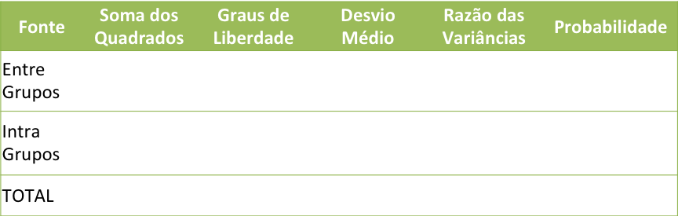
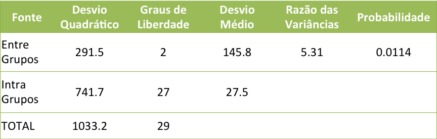

```{r setup, echo = F, message = F, cache = F}
knitr::opts_chunk$set(comment = NA, results = 'hide', message = FALSE, eval=FALSE, cache=FALSE, warning=FALSE)

#global options que vieram no rmdformats de html
library(knitr)
library(rmdformats)
library(lattice)
options(max.print="75")
opts_knit$set(width=75)
```

```{r setwd, echo=F}
setwd("../consultR/tutorials")
```

Neste roteiro usaremos um exemplo inicial para discutir algumas questões referentes à inferência estatística, distribuições de probabilidade, modelos estatísticos e testes de hipóteses. Este roteiro não pretende se aprofundar nestes temas, principalmente em relação aos aspectos formais e teóricos da Estatística. Nós enfocaremos na questão prática de entender como funcionam os modelos estatísticos lineares, como fazê-los, se nossos dados atendem às premissas destes e como interpretar os resultados destas análises no R.

Este roteiro nem de longe substitui um bom estudo/curso sobre estatística básica. Recomendamos fortemente a leitura do livro ["Estatística sem matemática"](http://www.editoraplanta.com.br/EsM.htm), para aprender mais sobre estatística de forma intuitiva e fluida.


# Um problema

Vamos começar esboçando um problema inicial. Um pesquisador prentende medir a altura de árvores em uma floresta, pois ele tem algumas idéias sobre a **distribuição de frequências de alturas** e gostaria de **inferir** sobre algumas características das árvores. É humanamente impossível medir todas as árvores da floresta (**população**), então ele pega uma **amostra aleatória** de árvores para prover as informações. Vamos ajudar esse pesquisador a analisar seus dados.

## Inferência estatística
Inferência estatística nada mais é do que tentar fazer afirmações sobre as características de uma **população**, com base em informações dadas por **amostras**. Para isso, nós vamos estimar os parâmetros reais da população através de nossa amostra. Nesse caso o termo **população** é qualquer conjunto de elementos que você está observando, ou seja, estamos nos referindo a uma população de números que podem ou não estar associados a uma população biológica. **Amostra** é qualquer subconjunto desta população.

A altura média das árvores da floresta é um **parâmetro** que não sabemos e então usaremos a amostra para **estimar** este parâmetro. Podemos estimar a **distribuição** das alturas na amostra e esperamos que esta reflita a distribuição de altura de todas as árvores. Temos então como calcular os descritores da amostra e como estimativa dos descritores reais da população. Porém, afirmar algo sobre uma população baseado em uma amostra pode ser perigoso e nos fazer cometer erros. 

O que nós fazemos então é ajustar um modelo teórico de distribuição de probabilidades nos nossos dados para poder inferir sobre os parâmetros da população. Por exemplo, observando o histograma da distribuição das alturas, os valores estimados da média e variância dos dados, modelamos a 'altura das árvores' como uma **variável aleatória** que tem uma **distribuição de probabilidades normal** com média (μ) e desvio padrão (σ).

Baixe o arquivo de dados [arvores.csv](https://www.dropbox.com/s/wthkhgox6ehbo4u/arvores.csv?dl=0) 
```{r dados importados, echo=F}
arv <-read.table("../data/arvores.csv", sep=";", header=T)

```

```{r dados}
# dados da altura das árvores coletadas pelo pesquisador
arv <-read.table("arvores.csv", sep=";")

hist(arv$alt)

mean(arv$alt)
var(arv$alt)
sd(arv$alt)
```


## Definindo variáveis aleatórias
A variável aleatória X é uma variável que tem um valor único (determinado aleatoriamente) para cada resultado de um experimento (lembre-se esse termo veio da teoria de probabilidade). A palavra aleatória indica que em geral só conhecemos aquele valor depois do experimento ser realizado.

Exemplos de variáveis aleatórias:

a. Altura das árvores de uma floresta (!!)

b. Número de presas capturadas por um predador em um determinado dia;

c. Comprimento de um peixe adulto selecionado aleatoriamente.

As variáveis aleatórias podem ser discretas ou contínuas.

**Variável aleatória discreta**: número ou a quantidade observada na unidade experimental ou tentativa.  
- Representada por números inteiros (0, 1, 2, 3, 4...);  
- Não pode conter números negativos;  
- Número finito de possibilidades;  
- Podemos achar a probabilidade de cada evento.  

**Variável aleatória contínua**: usualmente medidas contínuas como peso, altura, distância, pH, biomassa, etc.  
- Representada por números não inteiros (1.3, - 1.54, - 1.7);  
- Pode conter números negativos;  
- Número infinito de possibilidades;  
- Probabilidade de cada evento é zero.

Estas variáveis aleatórias terão sempre uma **função de probabilidade** associando cada possível valor da variável (X) à sua probabilidade de ocorrência P(X). Quando conhecemos todos os valores de uma variável aleatória, juntamente com suas respectivas probabilidades, temos uma **distribuição de probabilidades**. As distribuições de probabilidades discretas são conhecidas como função massa de probabilidade, enquanto que distribuições de probabilidade contínuas são conhecidas como função de densidade de probabilidade. A diferença está no fato de que nas distribuições discretas temos a probabilidade para cada valor de X, enquanto que nas distribuições contínuas temos a probabilidade para um intervalo.

Hoje em dia você pode usar diversas distribuições de probabilidades que melhor se ajustam aos seus dados (e até mesmo fazer testes que não levam em conta estas distribuições teóricas, mas não veremos isso aqui). Falaremos brevemente, sem mencionar os aspectos matemáticos de algumas distribuições mais usadas por biólogos. Para saber mais sobre estas distribuições recomendo ler a apostila ["Estatística aplicada à ecologia usando o R"](https://cran.r-project.org/doc/contrib/Provete-Estatistica_aplicada.pdf), de onde vieram algumas informações deste roteiro.


# Algumas Distribuições de Probabilidade

## Bernouli

Quando jogamos uma moeda, os resultados possíveis são cara ou coroa. Se a moeda não é viciada, a probabilidade de dar é cara a mesma probabilidade de dar coroa, ou seja 50%. Neste caso estamos interessados na ocorrência de **sucesso** ou **fracasso**. Assim, podemos definir uma variável aleatória X que assume apenas dois valores: 1 se ocorrer sucesso, 0 se ocorrer fracasso. Seu único parâmetro será _p_ que indica a probabilidade de sucesso. 

Seu valor esperado na distribuição será o próprio _p_

E[X] = p

e a sua variância

var[X] = p(1-p)


Usamos a notação X ~ Bernouli(p) para indicar esta variável. 

#### Exemplo

Vejamos um gráfico da função de probabilidade da Bernoulli com p=0.3:

```{r bernoulli}
plot(dbinom(0:1, size=1, prob=0.3), 
    xlim=c(0,3), ylim=c(0,1), 
    xlab="resultados previstos",
    ylab="Probabilidade", 
    main="Distribuição Bernoulli p=0.3",
    type="h", xaxt="n")
axis(1, at=c(1,2), labels = c(0,1))
```

Muitos dos dados de presença/ausência de espécies por exemplo, são modelados como uma distribuição de Bernoulli. 

## Binomial

Agora imagine que repetimos um ensaio de bernoulli _n_ vezes. Esta amostra será constituída de uma sequência de sucessos e fracassos.
A distribuição binomial é a distribuição de probabilidade **discreta** do **número de sucessos** em uma sequência de **n** tentativas tal que:  

i) as tentativas são independentes;   

ii) cada tentativa resulta apenas em duas possibilidades, sucesso ou fracasso; e   

iii) a probabilidade de cada tentativa, *p*, permanece constante.   

Se X ~ Bin(n, p), isto é, X é uma variável aleatória distribuída binomialmente, então o valor esperado de X é:

E[X] = np 

e a variância é

var[X] = np(1-p)

#### Exemplo

Há uma probabilidade de 0,30 de um girino, ao forragear em um corpo d’água, ser predado por uma larva de odonata. Vamos desenhar o histograma das probabilidades de que, dentre seis girinos que estão forrageando no corpo d’água, 0, 1, 2, 3, 5 ou 6 sejam predados.

```{r binomial}
plot(y=dbinom(0:6, size=6, prob=0.3), 
    x=c(0:6),
    xlab="Número de girinos predados",
    ylab="Probabilidade", 
    main="Distribuição binomial:  n=6, p=0.3",
    type="h")
```

## Poisson

Na teoria da probabilidade e na estatística, a distribuição de **Poisson** é uma distribuição de probabilidade discreta. Expressa a probabilidade de uma série de eventos ocorrem em um período fixo de tempo, área, volume, quadrante, etc. Esta distribuição segue as mesmas premissas da distribuição binomial:    

i) as tentativas são independentes;   

ii) a variável aleatória é o número de eventos em cada amostra; e   

iii) a probabilidade é constante em cada intervalo.

Se X ~ Pois(λ), isto é, X é uma variável aleatória com distribuição Poisson, então o valor esperado de X é

E[X] = (λ)

e a variância é

var[X] = (λ)

#### Exemplo

Suponha que um pesquisador registrou o número de visitas à flor de uma planta durante um período de 15 minutos. O número médio de borboletas que visitam no período de 15 minutos é 10 (λ). Vamos determinar a probabilidade de que cinco borboletas visitem a flor em 15 minutos. A probabilidade de uma borboleta visitar é a mesma para quaisquer dois períodos de tempo de igual comprimento. Abaixo o histograma dessa distribuição de probabilidade.

```{r poisson}
#probabilidade de que 5 borboletas visitem a flor:
dpois(5,10)

# histograma da distribuição
plot(dpois(seq(1,20, by =1), lambda = 10), type ="h",
     xlab = "Número de visitas", 
     ylab = "Probabilidade", 
     main = "Função massa de probabilidade")
```


## Normal

A distribuição normal é uma das mais importantes distribuições com probabilidades contínuas. Esta distribuição é descrita pelos parâmetros média (μ) e desvio padrão (σ), ou seja, conhecendo-se estes parâmetros consegue-se determinar qualquer probabilidade em uma distribuição Normal.  

A importância da distribuição normal como um modelo de fenômenos quantitativos é devido em parte ao [**Teorema Central do limite **](https://pt.wikipedia.org/wiki/Teorema_central_do_limite). O teorema afirma que "toda soma de variáveis aleatórias independentes de média finita e variância limitada é aproximadamente Normal, desde que o número de termos da soma seja suficientemente grande". Independentemente do tipo de distribuição da população, na medida em que o tamanho da amostra aumenta, a distribuição das médias amostrais tende a uma distribuição Normal.

Variáveis aleatórias com distribuição aproximadamente normal apresentam as seguintes propriedades:  

– Metade (50%) está acima (e abaixo) da média  

– Aproximadamente 68% está dentro de 1 desvio padrão da média  

– Aproximadamente 95% está dentro de 2 desvios padrões da média  

– Virtualmente todos os valores estão dentro de 3 desvios padrões da média  

#### Exemplo
Qual é a probabilidade de que um peixe capturado aleatoriamente tenha 20,15 cm ou mais, sabendo que a média da população é 17,1 cm e o desvio padrão é de 1,21 cm? Vamos descobrir usando a função `pnorm` e traçar o histograma dessa distribuição de probabilidade.

```{r normal}
# calculando a probabilidade de ter um peixe maior ou igual a 20.15
prob <- pnorm(q = 20.15, mean = 17.1, sd = 1.21, lower.tail = F)
prob

#histograma
x<-seq(13, 22, 0.1)
y=dnorm(x, mean = 17.1, sd=1.21)
plot(x, y, type="l", lwd=2, col="red", 
     ylab = "Probabilidade",
     xlab= "Comprimento dos peixes",
     main ="Função densidade de probabilidade")
abline(v = 17.1, lty=2)
abline(v = 20.15, lty=3)
```


# Voltando ao nosso problema


Voltamos então com nosso exemplo sobre as alturas das árvores de duas espécies em uma floresta. Nós modelamos estes dados como uma variável aleatória de distribuição normal. Porém, nós coletamos os dados de duas espécies diferentes. Será que a altura média de uma espécie nessa floresta é diferente da altura média da outra espécie? Ou seja, será que as espécies pertencem a uma mesma distribuição e as diferenças encontradas são devido ao acaso ou será que cada espécie é uma variável aleatória com médias diferentes?

Para inspecionar nossas dúvidas, vamos desenhar as distribuições de frequências das alturas separadamente para cada espécie:

```{r histograma}
histogram(~alt|sp, 
          data = arv,
          layout = c(1,2),
          strip=F,
          strip.left=T)
```


A diferença entre as médias observadas das espécies é:
```{r dif medias}
mean(arv$alt[arv$sp=="sp2"]) - mean(arv$alt[arv$sp=="sp1"])
```

Então, se afirmarmos que não há diferença entre as alturas das espécies, podemos estar incorrendo no erro chamado de **tipo 2**, de que há diferenças. Se afirmarmos que há diferença entre as alturas, ou seja rejeitamos a hipótese nula, podemos incorrer no erro do **tipo 1**, dizendo que há diferenças quando não há. Como decidir?

Vamos construir nossas hipóteses:

**H0** - não há diferença entre as alturas das duas espécies. A média da altura da espécie 1 é igual à média da altura da espécie 2 e a diferença observada se deve ao acaso.  

**H1** - há diferença entre as alturas das duas espécies. A média da altura da espécie 1 é diferente da média da altura da espécie 2.

Vamos definir os erros:

Ao escolher por uma das hipóteses, quais erros podemos cometer?

**ERRO DO TIPO I**: rejeitar a hipótese nula dada que ela é verdadeira.

**ERRO DO TIPO II**: aceitar a hipótese nula dado que ela é falsa.

Podemos calcular as probabilidades de cada um destes errros:

α: probabilidade do erro do tipo I

β: probabilidade do erro do tipo II

A quantidade α também é conhecida como **nível de significância do teste.**


Para sabermos se de fato uma árvore é, em média, mais alta que a outra, procederemos utilizando um teste de hipóteses, neste caso o **teste t**. Este teste basicamente irá contrastar a probabilidade de que a diferença que você encontrou nas médias das alturas das duas espécies pode se considerada devido ao acaso ou não. Ou seja, nossa pergunta é qual é a probabilidade de que as duas amostras pertencem à mesma população de medidas? Com que frequência esperaríamos amostras com médias tão ou mais diferentes do que a de nossas amostras se elas realmente vieram da mesma população de medidas? Vamos ver se podemos ou não rejeitar a hipótese nula (de que a diferença é ao acaso), baseado em alguma probabilidade de estarmos cometendo algum erro em nossa afirmação de que a hipótese nula é verdadeira.

#### Graus de liberdade

Tamanho da amostra: 100 árvores
Parâmetros estimados: média e variância: 2

Graus de liberdade: 100-2

Antes de partirmos para o teste t em si, precisamos entender o conceito de **graus de liberdade**. Para encontrar a probabilidade associda com qualquer valor em partircular de uma estatística (no nosso exemplo, a estatística t), precisamos conhecer quantas observações independentes foram usadas para calculá-las. Usualmente se diz que os graus de iberade dos testes estatísticos são o número de observações independentes menos o número de parâmetros estimados. Em nosso exemplo, tínhamos 100 árvores amostradas e estimamos a média e o desvio padrão para construir a distribuição de resultados esperados quando a hipótese nula era verdadeira. Portanto, o grau de liberdade para a estatística t em nosso exemplo é 100-2 = 98.

## Teste t

Não entraremos em detalhes de como se calcula a estatística t e como é a sua distribuição de probabilidades (recomendo ver na [wikipedia](https://pt.wikipedia.org/wiki/Distribui%C3%A7%C3%A3o_t_de_Student)). O importante a saber aqui é que tendo as duas amostras modeladas como uma distribuição normal, calculamos a estatística t e com um certo valor de graus de liberdade, nós podemos recorrer às tabelas da distribuição t para ver qual a probabilidade de se obter aquele valor que obtivemos dada que a hipótese nula é verdadeira. Se esta probabilidade for muito pequena, a chance de estarmos caindo no erro do tipo 1 é pequena.

No R, a função usada para fazer um teste t é `t.test`. 

```{r teste t}
t.test(arv$alt~arv$sp, var.equal=T)
#o argumento var.equa=T diz que as variâncias das duas espécies são as mesmas
# podemos fazer o teste com a premissa de que as variâncias não sejam iguais,
# usando var.equal=F, isso vai "consumir" graus de liberdade.
```

Vamos interpretar este resultado: temos o valor de t calculado e os graus de liberade (já calculado pela gente antes). Com estes 2 valores, o que o R faz é calcular a probabilidade de que a hipótese nula seja verdadeira. Esse é o **valor-p**, que neste exemplo deu um valor beem pequeno.
Vemos então que podemos rejeitar H0, com uma probabilidade muito baixa de estarmos incorrendo no erro de tipo 1, e desta forma acreditamos que as espécies de árvores tenham distribuições de alturas diferentes (médias diferentes).

 
O teste t possui três variantes básicas: a mais usada é normalmente chamada de **teste t para amostras independentes**, e permite a comparação de duas médias (a que acabamos de fazer) (mais roteiros [aqui](http://statistic-on-air.blogspot.com.br/2009/07/two-sample-students-t-test-1.html) e [aqui](http://statistic-on-air.blogspot.com.br/2009/07/two-sample-students-t-test-2.html) ); o **teste t para uma amostra** compara uma média com um valor fixo (roteiro [aqui](http://statistic-on-air.blogspot.com.br/2009/07/one-sample-students-t-test.html) ); e o **teste t pareado** (ou teste t para amostras dependentes) compara médias de unidades amostrais dependentes aos pares (roteiro [aqui](http://statistic-on-air.blogspot.com.br/2009/07/paired-students-t-test.html) ). Todos estas variações do teste t podem ser executadas no R pela função `t.test`, e o uso do teste t pareado e do teste t para uma amostra pode ser ativado com o uso dos argumentos `paired` e `mu`, respectivamente. Para saber mais como realizar estes testes no R, veja o capítulo 3 da apostila [Introdução ao uso do software R para as Ciências Biológicas](https://cantinhodor.files.wordpress.com/2015/03/introduc3a7c3a3o-ao-software-r-para-biologia-marcos-vital-ufal-marc3a7o-2015.pdf).

Recomendo também este [roteiro unicaulda de teste t](http://daniellakens.blogspot.com.br/2016/03/one-sided-tests-efficient-and-underused.html), que explica também a diferença entre um teste unicaudal e bicaudal. No teste unicaudal sua hipótese tem uma direção definida para a diferença entre as médias, por exemplo, esperamos que a sp1 seja maior do que a espécie 2. No teste bicaudal (o que acabamos de fazer), a hipótese diz respeito apenas se há diferença entre as médias e não qual é maior.


# Modelos lineares

E se tivéssemos na verdade 3 espécies de árvores para compararmos as alturas? Acabamos de ver que o teste t serve apenas para comparar duas amostras. O que chamamos de modelos lineares é uma grande família de modelos estatísticos que modelam uma relação linear entre a variável dependente (Y) e a(s) variável(is) independente(s). Nesta família encontra-se o teste t que acabamos de ver, a Análise de Variânci (ANOVA), a regressão, etc.

Chamamos de **Modelos Lineare Gerais** (LMs), aqueles que possuem como premissa a variável dependente Y como de distribuição Normal, e de **Modelos Lineares Genearlizados** (GLMs) os que assumem outros tipos de distribuição para a variável dependente (como a Binomial e Poisson). No R, a função que usamos para estes modelos são `lm` e `glm` (há alguns mais específicos como o prórpio `t.test` e o `aov` para ANOVA). O R lida com todos os modelos lineares de maneira similar, e um detalhe importante é que todas as análises desta família devem ser salvas em um objeto, para seu resultado ser apresentado após o comando `summary`.

É importante lembrar que neste roteiro estamos lidando com modelos paramétricos, ou seja, que **modela a variável de interesse como uma variável aleatória pertencente a uma certa distribuição de probabilidades**. Existem outras abordagens estatísticas não-paramétricas que fazem testes que não tem como premissa a distribuição de probabilidades. Veja um exemplo de **teste t não paramétrico** neste [roteiro](http://ecologia.ib.usp.br/bie5782/doku.php?id=bie5782:02_tutoriais:tutorial6:start). 

Mesmo fazendo parte de uma mesma família de modelos, nas sessões seguintes vamos separar os modelos lineares pelos nomes tradicionais das análises: análise de variância, regressão linear simples e análise de covariância. Depois, veremos alguns exemplos de GLMs aplicáveis a dados ecológicos.


## ANOVA

Vamos então incluir no nosso exemplo inicial uma terceira espécie amostrada (e vamos diminuir o número de amostras por espécie para ficar mais fácil de fazer os cálculos passo a passo):
```{r dados3}
alt.sp3 <- c(36.90076761,33.23131727,32.82767311,24.93410577,31.87626329,
         28.76824248,26.6436144,31.41238398,27.65383929,31.70425719,
         33.60752445,28.30263354,29.32210674,23.4790054,22.20793046,
         18.28797293,23.39044736,28.75820917,29.94344703,34.47430235,
         32.09820862,26.99845592,27.64858951,31.90557306,33.63236368,
         25.35966179,35.00885172,32.89125598,18.98802229,30.8516906,
         22.04191398,35.37232889,35.67150408,34.30257037,24.43038475,
         20.6274663,31.15717916,23.27023231,36.20568545,34.33068448,
         28.40769054,31.00578874,29.50989158,31.69915991,37.25975797,
         30.1279997,38.623371,35.36472829,29.88304259,31.00145491)

sp3 <- data.frame(alt=alt.sp3, sp=rep("sp3",50))
arv2 <- rbind(arv,sp3)

amostras <- seq(1,150,by=5)

arv3 <- arv2[ amostras, ]
```

Neste exemplo lidaremos com um modelo simples de anova chamado **_one way_ ANOVA**, porque lida apenas com uma variável independente categórica (fator). 

A ANOVA testará a hipótese nula de que as médias das alturas das 3 espécies não diferem. 

Faremos agora a ANOVA "na unha", para entendermos melhor cada passo da análise e a interpretação de seus resultados para depois usarmos a função do R que faz esta análise diretamente.

### ANOVA na unha

Vamos calcular os valores da tabela de ANOVA. Começando com os desvios quadráticos, ou seja, quanto os dados desviam da média (idéia parecida com a variância). O ponto importante é que essa variação é aditiva e portanto, pode se decomposta. A variação total é decomposta em variação relacionada ao tratamento (_entre grupos_), no nosso caso às espécies, e uma variação interna dos grupos (chamada de erro). A estatística F é a razão entre essas variaões após dividir cada uma delas pelos seus respectivos graus de liberdade. Complicou? Vamos fazer os cálculos e ver os gráficos para ver se entendemos melhor:

A tabela de ANOVA que vamos construir é essa:



Primeiro vamos mudar a forma do nosso data frame para facilitar os comandos
```{r}
arv4 <- data.frame(sp1=arv3$alt[arv3$sp=="sp1"],
                   sp2=arv3$alt[arv3$sp=="sp2"],
                   sp3=arv3$alt[arv3$sp=="sp3"])
arv4

boxplot(arv4)
```
Vamos calcular a média geral, as médias para cada espécie, e as diferenças entre a média geral e a média para cada espécie, para chegar ao valor da soma dos quadrados total:
```{r}
media.geral <- mean(arv3$alt)
media.geral

medias.sps <- apply(arv4, 2, mean)
medias.sps

dif.geral <- arv4 - media.geral
ss.especies <- dif.geral^2
ss.especies

ss.total <- sum(ss.especies)
ss.total
```

Para calcular os desvios quadráticos totais, nós subtraímos cada altura das árvores pela média geral e elevamos ao quadrado. Veja o gráfico:
```{r}
vetor.cor <- rep(1:3, each=10) #vetor de cores

plot(x = c(1:30), y = arv3$alt, ylim=c(10,40),
     pch=(rep(c(15,16,17), each=10)),
     col=vetor.cor,
     ylab="Variável Resposta", xlab="Observações",
     main="Variação total")
	for(i in 1:30)
	{
	lines(c(i,i),c(arv3$alt[i],mean(arv3$alt)),col=vetor.cor[i])
	}
	abline(h=media.geral)
```


Agora vamos fazer a somatória dos desvios quadráticos dentro de cada grupo (ss.intra).

O gráfico para entender esse cálculo:
```{r}
vetor.medias<-rep(medias.sps, each=10)

plot(c(1:30), arv3$alt, ylim=c(10,40),
     pch=(rep(c(15,16,17),each=10)),
     col=vetor.cor,
     main="Variação Intra Grupos",
     ylab="Variável Resposta", xlab="Observações")
	for(i in 1:30)
	{
	lines(c(i,i),c(vetor.medias[i],arv3$alt[i]),col=vetor.cor[i])
	}
	lines(c(1,10),c(medias.sps[1],medias.sps[1]),col=1)
	lines(c(11,20),c(medias.sps[2],medias.sps[2]),col=2)
	lines(c(21,30),c(medias.sps[3],medias.sps[3]),col=3)
```

Cálculo dos valores:
```{r}
medias.sps
ss.sp1=sum((arv4$sp1-medias.sps["sp1"])^2)
ss.sp1
ss.sp2=sum((arv4$sp2-medias.sps["sp2"])^2)
ss.sp2
ss.sp3=sum((arv4$sp3-medias.sps["sp3"])^2)
ss.sp3
ss.intra=ss.sp1+ss.sp2+ss.sp3
ss.intra
```

A soma dos quadrados entre grupos:
```{r}
plot(c(1:30), vetor.medias, ylim=c(10,40), 
  pch=(rep(c(15,16,17),each=10)),
  col=vetor.cor, 
  main="Variação Entre Grupos", 
  ylab="Variável Resposta", xlab="Observações")
 for(i in 1:30)
	{
	lines(c(i,i),c(vetor.medias[i],mean(vetor.medias)),col=vetor.cor[i])
	}
	abline(h=media.geral)
	points(c(1:30),arv3$alt, ylim=c(10,50), 
	       pch=(rep(c(0,1,2),each=10)), col=vetor.cor, cex=0.5)
```

```{r}
medias.sps
media.geral
ss.entre=10*sum((medias.sps-media.geral)^2)
ss.entre

#conferindo os cálculos
ss.intra+ss.entre
ss.total
```

Cálculo do F
```{r}
# Desvios médios
ms.entre=ss.entre/2
ms.intra=ss.intra/27
ms.entre
ms.intra

#F - razão das variâncias
F.sps=ms.entre/ms.intra
F.sps
```

#### Distribuição F

Vamos ver na distribuição F qual a probabilidade de termos econtrado o valor `F.sps` ao acaso:
```{r}
curve(expr=df(x, 2,27),
      main="Distribuição F de Fisher (df=2,27)", 
      xlab="Valor F",
      ylab="Densidade Probabilística (df)",
      xlim=c(2,12))
abline(v=F.sps, col="red")
abline(h=0, lty=2)

xf=seq(F.sps, 12, 0.01)
ydf=df(xf, 2, 27)
polygon(c(F.sps,xf),c(0,ydf),col="red")

text(x= 7,y=0.08,paste("pf(x) =",
     round(pf(F.sps,2,27,lower.tail=F),4)), 
     cex=0.8, col="red")
```

Cálculo do P
```{r}
p.sps=pf(F.sps, 2, 27, lower.tail=FALSE)
p.sps
```

Para mais informações sobre o F e as comparações com o teste t, veja esse [roteiro](http://daniellakens.blogspot.com.br/2016/04/one-sided-f-tests-and-halving-p-values.html).

### A tabela final

Colocando os dados calculados em nossa tabela de anova



### ANOVA no R

A função que constrói esta tabela de ANOVA e faz o teste estatístico é a `aov`. Vamos comparar:

```{r aov}
anova.sps <- aov(alt~sp, data=arv3)
summary(anova.sps)
```

Agora nós sabemos de ondem vem os números nesta tabela e como foi calculado o P, certo?

### Testes à posteriori

Perceba que a nossa hipótese nula na ANOVA é de que as 3 médias não diferem. Ao rejeitá-la, então, nós apenas sabemos que pelo menos duas das médias são diferentes entre si, mas não sabemos quais são.
Alguns estatísticos dizem que uma análise gráfica é  suficiente para saber quais médias diferem ou não entre si (por exemplo os autores do livro Estatística sem Matemática). Entretanto, há também a possibilidade de se fazer testes à posteriori que vão comparar as médias das espécies par a par. Vejamos aqui o mais utilizado **teste de Tukey HSD**, chamado pela função `TukeyHSD`, que atua diretamente no objeto com o resultado da ANOVA:

```{r tukey}
TukeyHSD(anova.sps)

#revendo gráfico dos dados
stripchart( arv3$alt~arv3$sp,
           vertical = TRUE, pch = 16, 
           col = c("black", "red", "green"))

#boxplot
boxplot(arv4)
```

Nossa análise então indicou que há diferenças entre as médias das alturas das árvore, mas que a espécie 1 não difere da espécie 2, mas difere da espécie 3, enquanto a espécie 2 difere da espécie 3. 

#### Outra maneira de fazer a ANOVA no R:

Talvez você se deparem com um código no R que faz a ANOVA usando a função `lm`, que é mais genérica e usada pra fazer qualquer análise de modelo linear geral (distribuição normal). Então vejamos:
```{r anova lm}
lm.anova.sp <- lm(alt~sp, data=arv3)
summary.aov(lm.anova.sp) #mesmo que o summary do aov

# mostra o resultado de forma um pouco diferente, consegue entender?
summary(lm.anova.sp) 
```

Vamos tentar interpretar o que esse segundo `summary` nos diz do modelo. A tabela de coeficientes tem tantas linha quanto paramêtros no modelo. No nosso caso nós temos 3 parâmetros que são as médias pra cada espécie.
A primeira linha da tabela (intercept), é a média do fator que vem primeiro em ordem alfabética, no nosso caso indica a média da primeira espécie. As outras duas linhas são as diferenças entre médias da primeira espécie (intercept) com a segunda e a terceira espécie, ou seja não são os valores das médias das espécies. A estatísticas calculadas em cada linha (Std. Error, t value e P), são calculadas para o valor do coeficiente apresentando. Então, o valor de P na primeira linha indica se aquele coeficiente estimado é diferente de zero. Na segunda linha, como estamos lidando com a diferença da média da espécie 2 com a espécie 1, o teste indica se essa diferença entre elas é significativa. O mesmo para a linha da espécie 3, o valor de p é a diferença dela com a espécie 1.


## Regressão linear simples

Vamos pensar agora se nossa variável independente (explicativa) fosse uma variável contínua, por exemplo a quantidade de nutrientes no solo. Nós criamos uma variável de quantidade de nutrientes (completamente fictícia como todos os dados), e queremos agora saber se a quantidade de nutrientes no solo afeta a altura das árvores. Nossa hipótese é de que quanto mais nutrientes, mais alta a árvore pode ficar. 
Nesse caso, chamamos esse modelo linear classicamente como regressão. 

Inserindo os dados de quantidade de nutrientes:
```{r dados regr}
# criando a variável nutrientes
nutri <- c(1.09, 1.73, 1.49, 2.84, 3.08, 8.24, 8.67, 6.10, 8.37, 8.03,
           10.62, 14.26, 13.77, 14.81, 14.40, 17.27, 15.46, 18.66, 16.03,
           17.37, 26.80, 27.1, 29.09, 20.46, 24.51, 28.56, 24.87, 27.44,
           26.02, 22.94)

# ordenando arv3 por altura (para criar uma relação com nutrientes)
arv3 <-arv3[order(arv3$alt), ]

#colocando no data.frame de dados
arv3$nutri <- nutri
```

Agora vamos observar a relação entre a altura da ávore e a quantidade de nutrientes no solo:
```{r plot regr}
plot(arv3$alt ~ nutri)
```

Vamos então modelar a relação e ver os resultados:
```{r mod regr}
alt.nutr <- lm(alt ~ nutri, data = arv3)
summary(alt.nutr)
```

Os resultados de uma regressão linear que rejeita a hipótese nula são comumente apresentados com uma representação gráfica que mostra os dados (em um gráfico de dispersão) e a equação (na forma de uma reta). Para adicionar a reta da equação ao gráfico criado pelo comando `plot`, basta, com o gráfico aberto, executar o comando `abline`, fazendo referência ao objeto que contém o resultado da regressão:

Vamos agora desenhar esta reta da regressão para entendermos melhor:
```{r plot regr2}
plot(arv3$alt ~ nutri)
abline(alt.nutr, col = "red") # reta da regressão

#reta da hipótese nula de ausência de efeito dos nutrientes
abline(h = mean(arv3$alt), col = "blue", lty = 2)  
```

Os resultados do `summary` são parecidos com os de uma ANOVA, mas conta com alguns detalhes a mais. No exemplo acima, a linha  do (Intercept) refere-se ao intercepto da equação linear (o **a**, na equação **y = a + bx**), e verifica a hipótese nula de que ele seria igual a zero; de uma forma geral, nós raramente nos preocupamos com a esta parte do resultado, pois o intercepto normalmente não faz parte da nossa pergunta. Já a linha debaixo, com o nome da variável explicativa (nutri), é sempre do nosso interesse: ela verifica a **hipótese nula de que o parâmetro b da equação (inclinação da reta) seja igual a zero**; ou seja, ao rejeitarmos a hipótese nula nós concluímos que de fato há uma relação estatisticamente significativa entre as duas variáveis, e que o efeito desta relação é medido por este parâmetro. Por fim, a interpretação da correlação, que está representada no parâmetro `Adjusted R-squared` também é importante, e mede o quanto da variação na variável resposta foi de fato explicada pela variável explicativa. 

Confuso? Então vejamos os resultados do exemplo acima: o teste rejeita a hipótese nula de que a altura das árvores não varia em função da quantidade de nutrientes (o valor de _p_ foi menor do que 0.05). O resultado da regressão permite concluirmos que, em média, cada incremento de uma unidade de nutriente aumenta a altura em 0,58 (este é o valor de **b** da equação). Por fim, o valor de **R² ajustado** nos diz que 76,3% da altura da árvore é explicada pela quantidade de nutrientes do local.


## ANCOVA

Com os dados das árvores nós testamos independentemente duas hipóteses: se a altura média das árvores era diferente para cada espécie e se a altura das árvores dependia da quantidade de nutrientes no solo. Mas porque fazer estas análises separadamente? Ambas as variáveis independentes podem influenciar na altura das árvores e, para isso, precisamos modelá-las em conjunto.

O modelo linear proposto abaixo é muitas vezes chamado de ANCOVA, ou seja, Análise de Covariância, que tem duas variáveis explicativas, uma categórica (no nosso caso a espécie de planta) e uma contínua (os nutrientes).

```{r ancova aditivo}
alt.sp.nutr <- lm(alt ~ nutri + sp, data = arv3)
summary(alt.sp.nutr)
```

O modelo proposta acima é o que chamamos de **modelo aditivo**, ou seja, as médias das alturas das árvores podem diferir, mas o efeito do nutriente é o mesmo para todas as espécies. 

Vejamos o gráfico de resultados do modelo:
```{r ancova plot}
# tirando os valores de intercepto do modelo para cada especie
coef(alt.sp.nutr)
int.sp1 <- coef(alt.sp.nutr)[1]
int.sp2 <- coef(alt.sp.nutr)[1]+coef(alt.sp.nutr)[3]
int.sp3 <- coef(alt.sp.nutr)[1]+coef(alt.sp.nutr)[4]

plot(alt~nutri, data=arv3)

# reta de regressão para espécie 1
abline(a=int.sp1, b=coef(alt.sp.nutr)[2], col="black")
# reta de regressão para sp 2
abline(a=int.sp2, b=coef(alt.sp.nutr)[2], col="red")
# reta de regressão para ps 3
abline(a=int.sp3, b=coef(alt.sp.nutr)[2], col="green")
```

Mas e se nós acreditamos que as espécies respondem de maneira diferente à quantidade de nutrientes no solo? Ou seja, uma espécie consegue crescer muito mais com a mesma quantidade de nutrientes do que as outras.

Para testar esse segundo modelo, inserimos então a _interação_ entre a variável qualitativa espécie e a quantitativa nutrientes. Essa interação nada mais é do que um novo fator resultado da multiplicação entre as variáveis. Esse novo modelo é chamado de **modelo com interação**. 

Existem duas notações de fórmula diferentes para este modelo mas que significam a mesma coisa:
```{r ancova interativo}
alt.sp.nutr2 <- lm(alt ~ nutri + sp + nutri:sp, data=arv3)
summary(alt.sp.nutr2)

alt.sp.nutr3 <- lm(alt ~ nutri*sp, data=arv3)
summary(alt.sp.nutr3)
```

Vejamos o gráfico de resultado
```{r ancova graf}
# interceptos
int.sp1 <- coef(alt.sp.nutr2)[1]
int.sp2 <- coef(alt.sp.nutr2)[1] + coef(alt.sp.nutr2)[3]
int.sp3 <- coef(alt.sp.nutr2)[1] + coef(alt.sp.nutr2)[4]

#coeficientes
coef.sp1 <- coef(alt.sp.nutr2)[2]
coef.sp2 <- coef(alt.sp.nutr2)[2] + coef(alt.sp.nutr2)[5]
coef.sp3 <- coef(alt.sp.nutr2)[2] + coef(alt.sp.nutr2)[6]

plot(arv3$alt~nutri, col=rep(c("black", "red", "green"),each=10))

abline(a=int.sp1, b=coef.sp1, col="black", xlim=c(0.5))
abline(a=int.sp2, b=coef.sp2, col="red")
abline(a=int.sp3, b=coef.sp3, col="green")
```

Olhando a tabela de ANOVA deste modelo vemos que a interação (nutri:sp) não foi significativa, e os nutrientes e as espécies são responsáves pela variação no na altura das árvores de maneira indepentende, ou seja, aditivamente:
```{r ancova test}
summary.aov(alt.sp.nutr3)
```

Se comparármos o modelo aditivo com o interativo através da `anova`, vemos que estes modelos nao são diferentes significativamente, e portanto, nós ficamos com o modelo mais simples (princípio da parcimônia):
```{r}
anova(alt.sp.nutr3, alt.sp.nutr)
```


Portanto, o modelo mais parcimonioso para nossa ANCOVA é o modelo aditivo, em que vemos a influência dos nutrientes na altura das árvores assim como a diferença na altura sendo explicada pela espécie de planta.

```{r selecao, echo=F}
m1 <- lm(alt ~ nutri * sp, data=arv3)
m2 <- lm(alt ~ nutri + sp, data=arv3)
m3 <- lm(alt ~ nutri , data=arv3)
m4 <- lm(alt ~ sp, data=arv3)
m5 <- lm(alt ~ 1, data=arv3)

library(bbmle)

AICtab(m1,m2,m3,m4,m5, base=T, weights=T)
```

# Modelos lineares generalizados

Os modelos estatísticos que lidamos até agora tem como pressupostos a distribuição Normal da variável resposta e homogeneidade de variâncias (tb conhecido como homocedasticidade). No entanto, em muitas situações a suposição de normalidade e varância constante não é plausível. Conseqüentemente, o uso de métodos que assumem a normalidade pode ser insatisfatório e aumentar a probabilidade de cometermos erros inferenciais (erros do Tipo I e II). É aí que entram os GLMs para modelar os dados quando a variância não é constante, e/ou quando os erros não são normalmente distribuídos. Muitos tipos de dados têm erros não normais. No passado, as únicas maneiras capazes de lidar com esse problema eram a transformação da variável resposta ou a adoção de métodos não paramétricos. Em GLM, assumimos que cada resultado da variável dependente Y seja gerado a partir de uma variedade de diferentes tipos de distribuições que lidam com esse problema:  

- Poisson – úteis para dados de contagem

- Binomial – úteis para dados com proporções
 
- Gamma – úteis para dados mostrando um coeficiente constante de variância 
 
- Exponencial – úteis com dados de análises de sobrevivência

Existem muitas razões para usar GLMs, em vez de regressão linear. Dados de presença-ausência são (geralmente) codificados como 1 e 0, os dados proporcionais são sempre entre 0 e 100%, e os dados de contagem são sempre não-negativos. GLMs usados para 0-1 e dados proporcionais são normalmente baseados em distribuição binomial e para dados de contagem as distribuições de Poisson e binomial negativa são opções comuns. A média, μ da distribuição depende das variáveis independentes, X, e é calculada através de:

E[Y]  = 𝜇 =g𝟏(𝑋𝛽)

onde E (Y) é o valor esperado de Y;  

Xβ é o preditor linear, uma combinação linear de parâmetros desconhecidos, β;  
g é a função de ligação.  

O GLM consiste em três etapas:

1. Uma hipótese sobre a distribuição da variável resposta Yi. Isso também define a média e a variância de Yi. (e.x., Distribuição Poisson, Binomial, Gamma).

2. Especificação da parte sistemática. Esta é uma função das variáveis explicativas. Y ~ a + bx 

3. A relação entre o valor médio de Yi e a parte sistemática. Esta é também chamada de função de ligação entre a média e a parte sistemática. Ou seja, é a função que lineariza a regressão ( o g(xB) de cima).

Para cada tipo de distribuição usada no GLM, temos uma função de ligação padrão (escrito em inglês pois serão os nomes dos argumentos no R):

<div align="center">
Distribuição | link function
-------------|-------------------
normal | identity
poisson | log
binomial | logit
Gamma | reciprocal
</div>


## GLM Poisson 

Vamos testar se o número de atropelamentos de uma estrada está relacionado com a distância a um Parque Nacional. Nossa variável resposta será o número de atropelamentos de um local e, portanto, vamos modelá-la como pertencente a uma distribuição de Poisson. 

Dados
```{r, echo=F}
atrop <- read.table("../data/atropela.csv", header = T, sep = ";")
```

```{r pois dados}
atrop <- read.table("atropela.csv", header = T, sep = ";")
atrop
```

Vamos ver o gráfico de dispersão dos dados
```{r pois plot}
plot( atrop$TOT.N ~ atrop$D.PARK)
```

Para modelar os dados vamos então fazer um modelo GLM, colocando como distribuição a Poisson, que tem por padrão a função de ligação "log"

```{r pois mod}
mod <- glm(TOT.N ~ D.PARK, data = atrop, 
           family = poisson)

summary(mod)
```

Vamos testar se este modelos é diferente do modelo nulo
```{r pois test}
anova(mod, test = "Chisq")
```

Podemos ver que este modelo é significativamente diferente do modelo nulo, portanto, a inclinação da reta da relação entre atropelamentos e distância ao parque é diferente de zero.

Vamos plotar  gráfico de resultado. Devemos lembrar que os coeficientes que aparecem no summary do modelos estão na escala do link function (nesse caso em log), por isso, antes de plotar a reta precisamos des-logaritmizar

```{r pois plot2}
coefi <- coef(mod)
coefi

plot(atrop$TOT.N~atrop$D.PARK,
     xlim = c(0,25000), ylim = c(0, 110),
     xlab = "Distância ao parque", ylab = "Número de atropelamentos")

#essa função plota a curva do modelo, colocamos exp para voltar à escala original dos dados
curve(exp(coefi[1] + coefi[2]*x), 
      xlim = c(0,25000), ylim = c(0, 110),
      xlab = "", ylab = "", 
      add=T, #adicionando a curva no plot já desenhado
      col="red")
```


## GLM Binomial


Vamos usar os dados de um trabalho que avaliou a quantidade de veados infectados com um parasita em cada local de amostragem. O pesquisador estava interessado em saber se a proporção de animais infectados era influenciada pela quantidade de um tipo de vegetação (OpenLand) nos locais de amostra.

```{r echo=F}
veados <- read.table("../data/veados_parasitas.csv", header=T, sep=";")
```

```{r binom dados}
veados <- read.table("veados_parasitas.csv", header=T, sep=";")
str(veados)
summary(veados)
```

Nestes dados temos o número de animais infectados, amostrados e a quantidade de habitat em cada local de amostragem.

A proporção de animais infectados é simplesmente o número de infectados do totoal de animais.
```{r binom prop}
prop.veados <- veados$infectado/veados$amostrado
prop.veados
```

Vejamos o gráfico dessa relação:
```{r binom plot}
plot(prop.veados ~ veados$openland,
     ylim=c(0,1))
```

De fato parece que a proporção de animais infectados diminui com o aumento da quantidade de 'openland' na paisagem.

Vamos fazer um modelo dos dados como pertencendo a uma distribuição binomial, pois diz respeito ao número de "sucessos" (infectados) em relação ao total de "tentativas" (animais amostrados). Usar os dados de proporção como a variável dependente estaria errado, pois em dados de proporção a distribuição não é normal e a variância não é homogênea (ela é muito maior em torno de 0.5).

Para modelar este dados a primeira coisa é criar a variáve Y como a combinação entre o número de infectados e não infectados usando a função `cbind` (junta colunas):
```{r binom cbind}
nao.infectado <- veados$amostrado- veados$infectado
y <- cbind(veados$infectado, nao.infectado)
```

Criando o modelo e vendo os resultados:
```{r binom mod}
mod.veado <- glm(y ~  openland, data=veados, family="binomial")
summary(mod.veado)
```

Vamos ver se nosso modelo é significativamente diferente do modelo nulo:
```{r binom test}
anova(mod.veado, test = "Chisq")
```

Sim, podemos dizer que a quantidade de habitat 'openland' influencia na probabilidade dos animais serem infectados pelo parasita. Essa relação é negativa, ou seja, quanto maior a quantidade de habitat, menores os níveis de infecção na população de veados.

Plotando a curva do modelo
```{r binom plot2}
# salvando os coeficientes
coefs <- coef(mod.veado)
coefs

#lembre que estes coefs foram linearizados com a função de ligação
# para a binomial a link function é a logit
# então temos que transformar os y no inverso do logit, a função é essa:
invlogit = function(x) return(exp(x)/(1+exp(x)))

plot(prop.veados ~ veados$openland,
     ylim=c(0,1))
#usando o invlogit para desenhar a curva:
curve(invlogit(coefs[1] + coefs[2]*x), add=T, col="red")
```


# Checando os modelos

Até agora nós fizemos nossos testes acreditando que as premissas deste estavam corretas e, portanto, os resultados dos testes confiáveis. Porém, é muito importante que nós façamos a checagem das premissas antes de depois de ajustar m modelo e fazer o teste estatístico. 

Por exemplo, podemos checar a homogeneidade de variância (homocedasticidade) e a normalidade da nossa variável de interesse fazendo testes específicos, como veremos abaixo (mais exemplos [nesta apostila](https://cran.r-project.org/doc/contrib/Itano-descriptive-stats.pdf) ). Entretanto, é importnate mencionar se sua amostra é pequena, estes testes não serão capazes de rejeitar a hipótese nula e portanto vão dizer que seus dados são normais ou homogêneos quando na verdade não são (erro tipo 2). Por isso, mesmo fazendo estes testes, checar o ajuste do modelo aos seus dados com gráficos de diagnóstico é crucial para que nos sintamos seguros de estarmos fazendo a inferência baseada na resposta dos testes dos modelos.

## Teste de normalidade

Um dos testes de normalidade muito utilizado é o teste de Shapiro-Wilks (`shapiro.test`). Neste teste a hipótese nula é de que os dados são normais, ou seja, se o resultado do teste der não significativo significa que os dados não se distanciam de uma distribuição normal.

```{r shapiro}
shapiro.test(arv3$alt)
```

Portanto, podemos ficar um pouco mais seguros de ter modelado nossos dados de altura das árvores como tendo uma distribuição normal. Mas não nos esqueçamos de que quando fizemos o teste t, nós assumimos que a altura das árvores da sp1 e a altura da sp2 seguiam distribuição normal, então vamos fazer para cada uma separadamente:
```{r shapiro2}
shapiro.test(arv$alt[arv$sp == "sp1"])
shapiro.test(arv$alt[arv$sp == "sp2"])
```

## Teste de homogeneidade de variâncias

Para saber se a variância dos dados é homogênea entre os grupos (no caso as variáveis categóricas X) podemos fazer o **teste de Barltett** ou **Levene**. 

Teste de Bartlett:
```{r bartlett}
bartlett.test(arv3$alt~arv3$sp)
```

Teste de Levene:
```{r levene}
# carregando o pacote car que tem a função do teste
library(car)

leveneTest(arv3$alt~arv3$sp)
```

O resultado não significativo para ambos os testes diz que as variâncias das alturas das espécies podem ser consideradas homogêneas.

Ótimo! Vamos agora checar o ajuste de nossos modelos lineares através do diagnóstico dos resíduos.


## Checagem do modelo - Resíduos

Depois de ajustar um modelo aos dados nós precisamos investigar quão bem o modelo descreve os dados. Em particular, nós deveríamos olhar se existe alguma tendência sistemática na **qualidade do ajuste (goodness of fit) do modelo** (lembre-se, nós ajustamos um modelo aos nossos dados e não nossos dados ao modelo!). Para isso nós trabalhamos com os **resíduos** do nosso modelo. 

Os **resíduos** são os desvios que nosso dados observados tem do modelo ajustado. Lembre-se das figuras da "ANOVA na unha", onde tinham os valores das médias para cada espécie e linhas ligando os pontos dos dados à este valor, essas linhas são os desvíos em relação à média, e portanto so resíduos do modelo. 

<div align="center">
RESÍDUO = Y(observado) - Y(dados ajustados)
</div>

Lembrando que nossa premissa de normalidade recai sobre os resíduos do modelo. Ou2 seja, são os resíduos que precisam ter distribuição normal. Nós checamos se a nossa variável resposta tem distribuição normal (por exemplo com o teste acima) porque se ela tem, provavelmente seu resíduos também o terão. 

Podemos "pegar" os resíduos do nosso modelo usando a função `residuals` ou `resid`.
```{r resid}
resid(anova.sps)
residuals(anova.sps) # o mesmo que a função de cima
```

Outra coisa importante para se ver durante a checagem do modelo é se existem dados (geralmente outliers) que estão influenciando mais o ajuste do modelo do que todos os outros. Numa regressão podemos pensar se existe alguns pontos que estão puxando a reta da regressão muito para baixo ou para cima, influenciando na estimação dos coeficientes da regressão.

Para analisar tudo isso nós usamos a função `plot` com o objeto do nosso modelo. Esse comando nos retorna 4 gráficos de diagnóstico. Vejamos nosso modelo da ANOVA:

```{r res anova}
# separando a área gráfica em 4 espaço para os 4 gráficos
par(mfrow=c(2,2))

plot(anova.sps)
```

O primeiro gráfico plota a relação entre os resíduos do modelo (`resid(anova.sps)`) e os valores ajustados (3 médias das alturas para as 3 espécies). O plot identifica valores que destoam dos valores médios. A linha vermelha que passa próxio ao zero dos resíduos indica se as variâncias dos resíduos estão homogêneas. Quanto mais "reta" essa linha, melhor o diagnóstico

O segundo gráfico já é conhecido (`qqnorm`) e mostra os ajustes dos quantis dos resíduos aos quantis de uma distribuição normal padrão (Z, média = 0, variância = 1). Quanto mais alinhados com a reta do plot, mais os dados se ajustam à normal. 

O terceiro gráfico é uma variação do primeiro e compara os valores da raiz quadrada dos resíduos padronizados. Lembrando que os resíduos padronizados serão **(residuo - media(residuo))/ sd(residuo)**.

O último gráfico nos mostra se nós temos dados "influentes", ou seja que estão puxando as médias das espécies pra cima ou pra baixo e, portanto modificando os coeficiente dos modelos. Neste exemplo não parece haver tendência de dados que estejam fazendo isso.

Vamos observar os gráficos de diagnóstico para todos os modelos que criamos anteriormente

```{r res lms}
# regressão: alt ~ nutri
plot(alt.nutr)

# ANCOVA modelo aditivo: alt ~ nutri + sps
plot(alt.sp.nutr)

# ANCOVA modelo interativo: alt ~ nutri * sps
plot(alt.sp.nutr2)

# GLM poisson: atrop ~ dist.park
plot(mod)

# GLM binoimial: prop.infectado ~ openland
plot(mod.veado)

# para "desligar" o par inicial
par(mfrow=c(1,1))
```

Então, o que acharam dos ajustes dos outros modelos? Bom, ruim? Leva tempo para nos acostumarmos a olhar estes gráficos e tirarmos conclusões de nossos ajustes. Não se desespere, procure ajuda vendo exemplos em livros e roteiros das análises no R ("google it!").

_**Parabéns por chegar até aqui!!!**_

Para entender melhor os temas abordados nesse roteiro, além dos links já passados, recomendo fortemente a leitura dos **Capítulos 8, 9, 10 e 13** (pelo menos) do livro **The R Book** do Crawley (se vc ainda não baixou, [aqui o link](http://gen.lib.rus.ec/book/index.php?md5=e09db860b99f0710ec5746796c101d59) ). 


